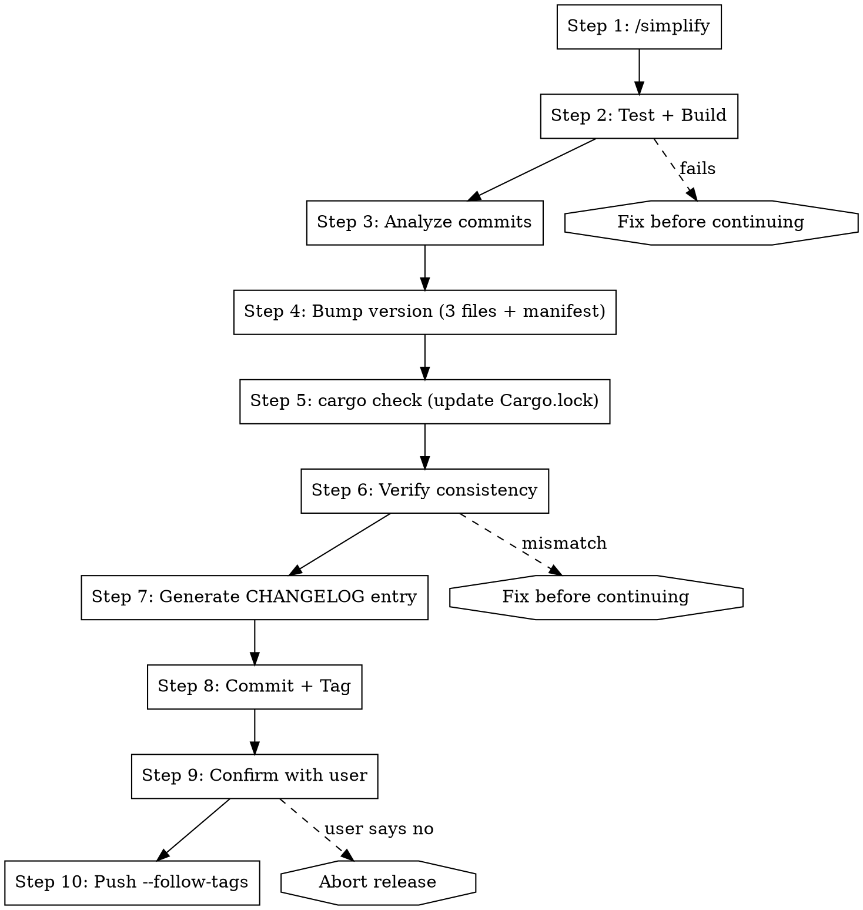

# Release

## Overview

One-click release: analyze commits, bump version, verify, commit, tag, push.

**Core principle:** Verify first, edit safely, verify again, push atomically.

**Announce at start:** "Using the release skill to prepare and ship a new version."

## The Process



### Step 1: Code Review

**You MUST invoke the `/simplify` skill using the Skill tool.** Do NOT substitute with `git diff` — that is just reading, not reviewing.

If the working tree is clean with unpushed commits, `/simplify` will review the diff against `origin/<branch>` automatically.

**"I ran git diff" is NOT code review. Invoke `/simplify`. No substitutes.**

Fix any issues found before proceeding.

### Step 2: Test + Build

Run ALL verification commands. Every one must pass.

```bash
npm test                    # Frontend tests
npm run build               # TypeScript + Vite build check
cd src-tauri && cargo test  # Rust tests
```

**If ANY test or build fails: STOP. Fix before continuing. Do not skip.**

### Step 3: Analyze Commits

List all unpushed commits with their conventional commit types:

```bash
git log origin/$(git branch --show-current)..HEAD --oneline
```

Categorize EVERY commit explicitly into a table:

| Commit | Type | Bump |
|--------|------|------|
| `abc1234 feat: add X` | feat | minor |
| `def5678 fix: correct Y` | fix | patch |
| `ghi9012 feat!: break Z` | feat! | **major** |

**Bump rules (Conventional Commits):**
- `feat!:` or body contains `BREAKING CHANGE:` → **major**
- `feat:` → **minor**
- `fix:` → **patch**
- `chore:` / `docs:` / `refactor:` / `test:` / `ci:` → **no bump** (but included in changelog)

**Final bump = highest among all commits.**

Show the table and proposed version to the user. Wait for confirmation before editing files.

### Step 4: Bump Version

**Three files + manifest must be updated.** Use `node -e` or `Edit` tool for safe JSON/TOML edits. NEVER use `sed` on version strings — it can match dependency versions.

Files to update:
1. `package.json` → `$.version`
2. `src-tauri/tauri.conf.json` → `$.version`
3. `src-tauri/Cargo.toml` → `[package].version`
4. `.release-please-manifest.json` → `$."."`

**Safe edit approach:**

```bash
# package.json — use node for precise JSON edit
node -e "
  const f = 'package.json';
  const p = JSON.parse(require('fs').readFileSync(f, 'utf8'));
  p.version = 'NEW_VERSION';
  require('fs').writeFileSync(f, JSON.stringify(p, null, 2) + '\n');
"
```

For Cargo.toml, use the `Edit` tool to replace the exact `version = "OLD"` line under `[package]`.

### Step 5: Update Cargo.lock

```bash
cd src-tauri && cargo check
```

This regenerates `Cargo.lock` with the new version. Do NOT skip this — a stale lockfile will cause CI failures.

### Step 6: Verify Consistency

**Use `node -e` for JSON files, not `grep`.** Grep on JSON is fragile — it matches partial strings and ignores structure.

```bash
node -e "
  const fs = require('fs');
  const expected = 'NEW_VERSION';
  const checks = [
    ['package.json', JSON.parse(fs.readFileSync('package.json','utf8')).version],
    ['tauri.conf.json', JSON.parse(fs.readFileSync('src-tauri/tauri.conf.json','utf8')).version],
    ['manifest', JSON.parse(fs.readFileSync('.release-please-manifest.json','utf8'))['.']],
  ];
  const toml = fs.readFileSync('src-tauri/Cargo.toml','utf8');
  const m = toml.match(/^\[package\][\s\S]*?^version\s*=\s*\"([^\"]+)\"/m);
  checks.push(['Cargo.toml', m ? m[1] : 'NOT FOUND']);
  checks.forEach(([f,v]) => console.log(v === expected ? '  OK' : 'FAIL', f, '→', v));
  if (checks.some(([,v]) => v !== expected)) { console.error('VERSION MISMATCH'); process.exit(1); }
"
```

**All 4 must show the same version. If ANY mismatch or the script exits non-zero: STOP and fix.**

### Step 7: Generate CHANGELOG Entry

Check if `CHANGELOG.md` exists. If yes, prepend the new entry after any existing header. If no, create it.

**You MUST produce a concrete CHANGELOG entry with real commit data.** Do not say "group by type" and leave it vague — write the actual entries.

Format:

```markdown
## [X.Y.Z] - YYYY-MM-DD

### Features
- Add brainstorm module for session management (#abc1234)
- Register open_brainstorm_terminal command (#def5678)

### Bug Fixes
- Fix CLI detection when app launched from Finder (#ghi9012)

### Other Changes
- Rename todo to ideas in sidebar labels (#jkl3456)
```

Rules:
- Group by: Features (`feat`), Bug Fixes (`fix`), Other Changes (everything else)
- Each line = one commit, human-readable description + short hash
- Omit empty groups
- Use the commit subject line, cleaned up for readability (drop the `feat:` / `fix:` prefix)

### Step 8: Commit + Tag

```bash
git add package.json src-tauri/Cargo.toml src-tauri/Cargo.lock \
       src-tauri/tauri.conf.json .release-please-manifest.json \
       CHANGELOG.md

git commit -m "$(cat <<'EOF'
chore: release vX.Y.Z

Co-Authored-By: Claude <noreply@anthropic.com>
EOF
)"

git tag vX.Y.Z
```

### Step 9: Confirm Before Push

Show the user exactly what will be pushed:

```
Ready to push:
- N commits (including version bump)
- Tag: vX.Y.Z
- This will trigger the release workflow (build DMG + GitHub Release)

Proceed? (yes/no)
```

**Wait for explicit "yes". Do not proceed on ambiguous responses.**

### Step 10: Push Atomically

```bash
git push --follow-tags
```

Single command. Atomic. Commits and tag go together.

**NEVER use two separate push commands** — if the tag push fails after commits push, you're in a broken state.

## Quick Reference

| Step | Action | Gate |
|------|--------|------|
| 1 | /simplify | Fix issues |
| 2 | Test + Build | All pass |
| 3 | Analyze commits | User confirms version |
| 4 | Bump 3 files + manifest | Safe edits only |
| 5 | cargo check | Cargo.lock updated |
| 6 | Verify consistency | All 4 match |
| 7 | CHANGELOG | Prepend entry |
| 8 | Commit + Tag | Single commit |
| 9 | Confirm with user | Explicit "yes" |
| 10 | Push --follow-tags | Atomic |

## Common Mistakes

**Using sed for version edits**
- Problem: `sed 's/0.10.0/0.11.0/'` matches dependency versions too
- Fix: Use `node -e` for JSON, `Edit` tool for TOML

**Skipping cargo check after Cargo.toml edit**
- Problem: Stale Cargo.lock causes CI build failure
- Fix: Always run `cargo check` after version bump

**Two separate git push commands**
- Problem: Tag push can fail after commits push → broken state
- Fix: Always use `git push --follow-tags`

**Skipping tests "because nothing changed"**
- Problem: Unpushed commits may have untested interactions
- Fix: Always run full test suite before release

**Not verifying version consistency**
- Problem: One file missed → version mismatch in production
- Fix: Grep all 4 files and compare before committing

## Red Flags — STOP

- Skipping tests or build verification
- Using sed/awk for version edits
- Using grep on JSON files for version verification
- Pushing without user confirmation
- Two separate push commands
- Not categorizing every commit
- Proceeding with version mismatch
- Running `git diff` instead of invoking `/simplify`
- Vague CHANGELOG ("group by type") without actual entries

**All of these mean: Go back to the step you skipped.**

## Rationalization Table

| Excuse | Reality |
|--------|---------|
| "I'll just run git diff instead of /simplify" | git diff is reading, not reviewing. Invoke the skill. |
| "Tests passed last time, nothing changed" | Unpushed commits interact. Run the full suite. |
| "sed is fine for this simple case" | sed matches dependency versions. Use node -e or Edit. |
| "grep is good enough for version check" | grep on JSON is fragile. Use the node -e verification script. |
| "I'll push commits first, then the tag" | If tag push fails, you're in a broken state. --follow-tags only. |
| "The user seems to want this fast, skip review" | Speed doesn't justify shipping broken code. Every step matters. |
| "CHANGELOG can be filled in later" | Later never comes. Write concrete entries now with real commit data. |
| "Only feat/fix commits matter for CHANGELOG" | All commits ship. All commits get documented. |
