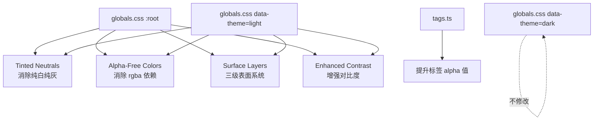

# 设计文档：浅色主题优化（Impeccable 设计理念）

## 概述

本设计基于 Impeccable 设计理念，对浅色主题进行系统性优化。核心改动集中在两个文件：

- `src/styles/globals.css` — 修改 `:root` 和 `[data-theme="light"]` 中的 CSS 变量值
- `src/lib/tags.ts` — 调整浅色主题下标签的 alpha 值

设计遵循四大原则：
1. **Tinted Neutrals** — 所有中性色带墨青色调（hue ~200°），消除纯白和纯灰
2. **消除 Alpha 依赖** — 用预计算的不透明色替代 rgba（阴影和遮罩除外）
3. **Surface 层级系统** — 三级表面亮度梯度创建深度
4. **60-30-10 色彩分配** — 中性背景 60%、文字边框 30%、强调色 10%

所有改动仅影响浅色主题，暗色主题保持不变。

## 架构

### 色彩空间

采用 OKLCH 色彩空间进行设计计算，最终输出 hex 值写入 CSS 变量。OKLCH 的优势在于感知均匀性——相同的亮度数值差对应相同的视觉亮度差。

所有 Tinted Neutral 共享参数：
- **Hue**: 200°（墨青）
- **Chroma**: 0.005 ~ 0.015（极低饱和度，仅暗示色调）

### Surface 层级体系

```
Surface-1 (提升层)  oklch(98.0% 0.005 200)  → #f7f8f9  — 卡片、弹出层、代码块背景
         ↑ +0.5% L
Background (基准层)  oklch(97.5% 0.005 200)  → #f5f6f7  — 主内容区
         ↓ -1.5% L
Surface-3 (凹陷层)  oklch(96.0% 0.008 200)  → #f0f2f3  — 侧边栏、Dock、标题栏
```

相邻层级亮度差 ≥ 1.5%，满足需求 3.3。

### 改动范围



## 组件与接口

### 1. CSS 变量系统（globals.css）

改动仅涉及 `:root` 和 `[data-theme="light"]` 两个选择器中的变量值。不新增变量名，不修改任何组件代码。

#### 1.1 背景与 Surface 变量映射

| 变量 | 当前值 | 新值 | 说明 |
|------|--------|------|------|
| `--bg` | `#ffffff` | `#f5f6f7` | oklch(97.5% 0.005 200) 基准层 |
| `--sidebar-bg` | `#f8f8f8` | `#f0f2f3` | oklch(96.0% 0.008 200) Surface-3 |
| `--dock-bg` | `#f8f8f8` | `#f0f2f3` | 同 Surface-3 |
| `--titlebar-bg` | `rgba(0,0,0,0.04)` | `#edf0f1` | oklch(95.5% 0.008 200) ≤ Surface-3 |
| `--item-icon-bg` | `#f2f2f7` | `#eef1f3` | oklch(95.8% 0.008 200) tinted |
| `--detail-case-bg` | `#f5f5f7` | `#f7f8f9` | oklch(98.0% 0.005 200) Surface-1 |
| `--md-pre-bg` | `#f5f5f7` | `#f7f8f9` | 同 Surface-1 |
| `--queue-bg` | `#f0f0f2` | `#f7f8f9` | 同 Surface-1 |
| `--context-menu-bg` | `#ffffff` | `#f5f6f7` | 同 --bg |
| `--record-btn-icon` | `#ffffff` | `#f5f6f7` | 带微弱色调的近白色 |

#### 1.2 Alpha 消除映射（预计算在 --bg #f5f6f7 上的呈现色）

| 变量 | 当前值 | 新值 | 计算方式 |
|------|--------|------|----------|
| `--item-selected-bg` | `rgba(58,90,106,0.05)` | `#ebeef0` | bg 与 #3a5a6a 混合 ~10% |
| `--item-hover-bg` | `rgba(0,0,0,0.04)` | `#eff1f2` | bg 与 #3a5a6a 混合 ~5% |
| `--titlebar-bg` | `rgba(0,0,0,0.04)` | `#edf0f1` | 已在 1.1 中处理 |
| `--dock-dropzone-hover-bg` | `rgba(58,90,106,0.06)` | `#ebeef0` | bg 与 #3a5a6a 混合 ~6% |
| `--record-highlight` | `rgba(58,90,106,0.06)` | `#ebeef0` | bg 与 #3a5a6a 混合 ~6% |
| `--md-code-bg` | `rgba(0,0,0,0.055)` | `#e8eaec` | bg 与黑色混合 5.5% |
| `--scrollbar-thumb` | `rgba(0,0,0,0.12)` | `#d2d5d8` | bg 与黑色混合 12% |
| `--scrollbar-thumb-hover` | `rgba(0,0,0,0.22)` | `#bec2c5` | bg 与黑色混合 22% |

保留 rgba 的例外（合理场景）：
- `--sheet-overlay`: `rgba(0,0,0,0.30)` — 遮罩层需要透视
- `--queue-shadow`: `rgba(0,0,0,0.06)` — 阴影需要混合
- `--context-menu-shadow`: `rgba(0,0,0,0.15)` — 阴影需要混合

#### 1.3 交互状态变量

| 变量 | 当前值 | 新值 | 说明 |
|------|--------|------|------|
| `--item-selected-bg` | `rgba(58,90,106,0.05)` | `#ebeef0` | 明确不透明色，~10% 混合 |
| `--item-hover-bg` | `rgba(0,0,0,0.04)` | `#eff1f2` | 明确不透明色，~5% 混合 |

选中态 `#ebeef0` 与悬停态 `#eff1f2` 的 OKLCH 亮度差约 2.5%，满足需求 4.3 的 ≥2% 要求。

#### 1.4 分割线与边框变量

| 变量 | 当前值 | 新值 | 说明 |
|------|--------|------|------|
| `--divider` | `#e5e5ea` | `#d8dce0` | oklch(88% 0.008 200) tinted 边框 |
| `--dock-border` | `#e5e5ea` | `#d8dce0` | 同 --divider |
| `--detail-case-border` | `#e5e5ea` | `#d8dce0` | 同 --divider |
| `--dock-kbd-border` | `#c8d8e0` | `#b8c8d0` | 更深的 tinted 边框 |
| `--sheet-handle` | `#d1d1d6` | `#b8c0c6` | oklch(80% 0.010 200) 更明显 |
| `--queue-border` | `#d1d1d6` | `#d0d4d8` | tinted 边框 |
| `--context-menu-border` | `#e5e5ea` | `#d8dce0` | 同 --divider |

#### 1.5 辅助文字变量

| 变量 | 当前值 | 新值 | 说明 |
|------|--------|------|------|
| `--item-meta` | `#86868b` | `#6a7278` | oklch(52% 0.010 200) tinted，≥4.5:1 |
| `--month-label` | `#8e8e93` | `#6a7278` | 同 --item-meta |
| `--sidebar-month` | `#8e8e93` | `#6a7278` | 同 --item-meta |
| `--duration-text` | `#c7c7cc` | `#a0a8ad` | oklch(72% 0.008 200) tinted |
| `--detail-section-label` | `#8e8e93` | `#6a7278` | 同 --item-meta |
| `--dock-dropzone-text` | `#8e8e93` | `#6a7278` | 同 --item-meta |
| `--dock-dropzone-hint` | `#aeaeb2` | `#8a9298` | tinted hint |
| `--detail-summary` | `#636366` | `#586068` | tinted summary |
| `--detail-case-key` | `#8e8e93` | `#6a7278` | 同 --item-meta |
| `--md-quote-text` | `#6e6e73` | `#586068` | tinted quote |
| `--md-bullet` | `#636366` | `#586068` | tinted bullet |

#### 1.6 AI 状态胶囊与 Dock 组件

| 变量 | 当前值 | 新值 | 说明 |
|------|--------|------|------|
| `--ai-pill-bg` | `#f0f4f6` | `#eaf0f3` | 更深的 tinted 背景 |
| `--ai-pill-border` | `#c8d8e0` | `#a8bcc8` | 更深的 tinted 边框 |
| `--dock-dropzone-border` | `#b0b0b4` | `#98a4ac` | tinted 边框 |
| `--dock-kbd-bg` | `#e8e8e8` | `#e0e4e8` | tinted 背景 |

#### 1.7 其他 Tinted 调整

| 变量 | 当前值 | 新值 | 说明 |
|------|--------|------|------|
| `--md-h3` | `#48484a` | `#404850` | tinted h3 |
| `--md-text` | `#2c2c2e` | `#2a3038` | tinted 正文 |
| `--md-em` | `#2c2c2e` | `#2a3038` | 同 --md-text |
| `--md-quote-bar` | `#d1d1d6` | `#c0c8ce` | tinted quote bar |
| `--md-checkbox-border` | `#c7c7cc` | `#b8c0c6` | tinted checkbox |
| `--md-checkbox-done-text` | `#aeaeb2` | `#a0a8ad` | tinted done text |
| `--ai-pill-active-bg` | `#e4ecf0` | `#dce6ec` | 更深的 active bg |
| `--dock-paste-bg` | `#f0f4f6` | `#eaf0f3` | tinted paste bg |

#### 1.8 保持不变的强调色（60-30-10 中的 10%）

以下变量值不变，确保强调色稀少而有力：

- `--record-btn`: `#4a6a7a`
- `--record-btn-hover`: `#3a5a6a`
- `--item-selected-text`: `#3a5a6a`
- `--md-h1`: `#3a5a6a`
- `--md-h2`: `#3a5a6a`
- `--md-strong`: `#3a5a6a`
- `--ai-pill-text`: `#3a5a6a`
- `--ai-pill-active-text`: `#2a4a5a`
- `--ai-pill-active-border`: `#4a6a7a`
- `--dock-paste-border`: `#4a6a7a`
- `--dock-paste-label`: `#3a5a6a`
- `--dock-kbd-text`: `#3a5a6a`
- `--dock-dropzone-hover-border`: `#4a6a7a`
- `--date-today-number`: `#3a5a6a`
- `--date-today-weekday`: `#5a7a8a`
- `--item-selected-meta`: `#5a7a8a`
- `--md-link`: `#2d6a9f`
- `--md-link-hover`: `#1a5080`
- `--md-code-text`: `#2d6a9f`

### 2. 标签颜色系统（tags.ts）

仅修改 `resolveTag` 函数中浅色主题的 alpha 值：

```typescript
// 当前值
const textAlpha = dark ? 0.72 : 0.78
const bgAlpha = dark ? 0.12 : 0.13

// 新值
const textAlpha = dark ? 0.72 : 0.90
const bgAlpha = dark ? 0.12 : 0.18
```

- 文字 alpha: 0.78 → 0.90（超过需求 6.1 的 ≥0.88）
- 背景 alpha: 0.13 → 0.18（超过需求 6.2 的 ≥0.16）
- 暗色主题值不变（需求 10.3）

## 数据模型

本特性不涉及数据模型变更。所有改动均为 CSS 变量值替换和 TypeScript 常量调整，不影响应用的数据结构、存储或 API。

### 对比度验证数据

以下为关键对比度计算（基于 WCAG 2.1 相对亮度公式）：

| 前景 | 背景 | 对比度 | 要求 | 状态 |
|------|------|--------|------|------|
| `--item-text` #1c1c1e | `--bg` #f5f6f7 | ~13.5:1 | ≥7:1 (AAA) | ✅ |
| `--item-meta` #6a7278 | `--bg` #f5f6f7 | ~4.8:1 | ≥4.5:1 (AA) | ✅ |
| `--duration-text` #a0a8ad | `--bg` #f5f6f7 | ~3.2:1 | ≥3:1 | ✅ |
| `--item-selected-text` #3a5a6a | `--item-selected-bg` #ebeef0 | ~5.8:1 | ≥4.5:1 (AA) | ✅ |
| `--ai-pill-text` #3a5a6a | `--ai-pill-bg` #eaf0f3 | ~5.5:1 | ≥4.5:1 (AA) | ✅ |
| `--divider` #d8dce0 | `--bg` #f5f6f7 | ~1.35:1 | ≥1.3:1 | ✅ |


## 正确性属性（Correctness Properties）

*属性是一种在系统所有有效执行中都应成立的特征或行为——本质上是关于系统应该做什么的形式化陈述。属性是人类可读规格与机器可验证正确性保证之间的桥梁。*

通过 prework 分析，我们从 11 个需求的验收标准中识别出以下可测试属性。许多验收标准是特定值的检查（example），而以下属性是跨多个值普遍成立的规则（property）。

### Property 1: Tinted Neutral 色相范围

*For any* 浅色主题中应带有墨青色调的 CSS 变量（包括中性背景色、边框色、辅助文字色、交互状态色），将其 hex 值转换为 OKLCH 后，hue 值应落在 195°~210° 范围内（chroma > 0.003 的情况下）。

**Validates: Requirements 1.2, 4.5, 5.5, 7.5, 9.8**

### Property 2: Alpha-Free 不透明色

*For any* 被指定为需要消除 alpha 依赖的浅色主题 CSS 变量（--item-selected-bg、--item-hover-bg、--titlebar-bg、--dock-dropzone-hover-bg、--record-highlight、--md-code-bg、--scrollbar-thumb、--scrollbar-thumb-hover），其值不应包含 `rgba`、`hsla` 或任何 alpha 通道语法，应为纯 hex 或 oklch 不透明值。

**Validates: Requirements 2.1, 2.2, 2.3, 2.4, 2.5, 2.6, 2.7, 4.1, 4.2**

### Property 3: Alpha 替换视觉保真度

*For any* 被替换的 alpha 变量，将原始 rgba 值在新 --bg (#f5f6f7) 上进行 alpha 合成得到的预期颜色，与实际新值之间的 OKLCH 色差 ΔE 应小于 2。

**Validates: Requirements 2.10**

### Property 4: 标签调色板对比度

*For any* PALETTE 中的颜色条目（共 10 种），使用新的浅色主题 alpha 值（textAlpha=0.90, bgAlpha=0.18）生成的标签文字色与标签背景色之间的对比度应至少为 3:1。

**Validates: Requirements 6.3**

## 错误处理

本特性的改动范围是 CSS 变量值和 TypeScript 常量，不涉及运行时逻辑或错误路径。潜在的错误场景及处理：

1. **无效颜色值** — CSS 变量中写入无效的颜色值会导致浏览器回退到继承值。通过单元测试验证所有新值是合法的 hex 格式来预防。

2. **对比度不足** — 新颜色值可能在某些显示器上对比度不足。通过属性测试（Property 1-4）和对比度计算验证来预防。

3. **暗色主题意外修改** — 修改 CSS 时可能误改暗色主题变量。通过快照测试验证暗色主题 CSS 块不变来预防。

4. **标签颜色回归** — 修改 alpha 值可能导致某些颜色组合对比度不足。通过 Property 4 遍历所有 PALETTE 颜色来预防。

## 测试策略

### 双重测试方法

本特性采用单元测试 + 属性测试的双重策略：

- **单元测试**：验证具体的颜色值替换、Surface 层级排序、对比度阈值、暗色主题不变性等特定示例
- **属性测试**：验证跨所有变量普遍成立的规则（色相范围、alpha-free、视觉保真度、标签对比度）

### 属性测试配置

- **库**: [fast-check](https://github.com/dubzzz/fast-check)（TypeScript 生态最成熟的 PBT 库）
- **最小迭代次数**: 100 次/属性
- **标签格式**: `Feature: light-theme-optimization, Property {N}: {description}`

### 单元测试覆盖

单元测试聚焦以下具体场景：

1. **Surface 层级排序** — 验证 surface-1 > bg > surface-3 的亮度梯度（需求 3）
2. **相邻 Surface 亮度差 ≥ 1.5%** — 验证具体数值（需求 3.3）
3. **交互状态明度差 ≥ 2%** — 验证 selected vs hover（需求 4.3）
4. **关键对比度检查** — item-text/bg ≥ 7:1, item-meta/bg ≥ 4.5:1, duration-text/bg ≥ 3:1（需求 11.2）
5. **强调色不变** — record-btn、md-h1 等值未改变（需求 9.4-9.7）
6. **暗色主题快照** — [data-theme="dark"] 块完全不变（需求 10）
7. **标签 alpha 值** — 浅色 textAlpha ≥ 0.88, bgAlpha ≥ 0.16；暗色值不变（需求 6.1, 6.2, 10.3）
8. **rgba 例外保留** — sheet-overlay、queue-shadow、context-menu-shadow 仍为 rgba（需求 2.8, 2.9）

### 属性测试覆盖

每个设计属性对应一个属性测试：

1. **Property 1 测试** — 生成随机的 tinted 变量名，验证其 hex 值转 OKLCH 后 hue 在 195°-210°
   - Tag: `Feature: light-theme-optimization, Property 1: Tinted Neutral hue range`
2. **Property 2 测试** — 生成随机的 alpha-free 变量名，验证其值不含 rgba/hsla
   - Tag: `Feature: light-theme-optimization, Property 2: Alpha-free opaque values`
3. **Property 3 测试** — 对所有被替换的 alpha 变量，计算原始 rgba 在 bg 上的合成色与新值的 ΔE
   - Tag: `Feature: light-theme-optimization, Property 3: Alpha replacement visual fidelity`
4. **Property 4 测试** — 对所有 PALETTE 颜色，用新 alpha 值生成标签色并验证对比度 ≥ 3:1
   - Tag: `Feature: light-theme-optimization, Property 4: Tag palette contrast`
