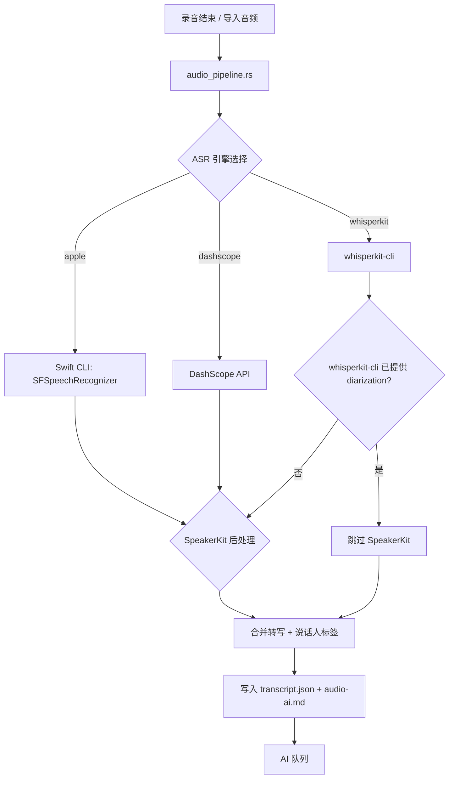
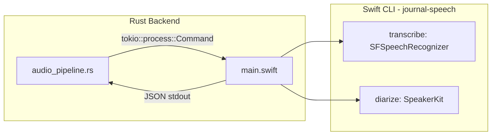

# 设计文档：内置 SpeakerKit 与 Apple 原生 STT 引擎

## 概述

本设计为谨迹引入两项核心能力：

1. **内置 SpeakerKit 说话人识别**：将说话人分离（diarization）从 whisperkit-cli 依赖中解耦，作为独立的后处理步骤运行，与任意转写引擎配合。
2. **Apple 原生 STT 引擎**：基于 macOS `SFSpeechRecognizer` 的语音转写引擎，零配置、零下载，作为新用户默认引擎。

两项能力通过一个 Swift CLI sidecar 统一封装，Rust 后端通过 `tokio::process::Command` 调用，与现有 whisperkit-cli 调用模式对称。

### 设计决策与理由

| 决策 | 理由 |
|------|------|
| Swift CLI sidecar 而非 FFI | SpeakerKit 和 SFSpeechRecognizer 是 Swift-only API，进程隔离更安全，崩溃不影响主进程 |
| SpeakerKit 独立于转写引擎 | 使说话人识别可与 Apple STT、DashScope 等任意引擎组合 |
| 仅实现 SFSpeechRecognizer | 用户明确要求本期不涉及最新 macOS 语音识别引擎 |
| 默认引擎改为 Apple STT | 零配置体验，降低新用户门槛 |
| 保留 whisperkit-cli 自带 diarization | WhisperKit 已内置说话人分离，无需重复处理 |

---

## 架构

### 整体数据流



### Swift CLI 架构

新增一个 Swift 命令行工具 `journal-speech`，内置于应用安装包中，提供两个子命令：

```
journal-speech transcribe --audio <path> --language zh-CN
journal-speech diarize --audio <path>
```

输出统一为 JSON 格式，通过 stdout 返回。



### 模块职责变更

| 模块 | 现有职责 | 新增/变更 |
|------|---------|----------|
| `config.rs` | ASR 引擎配置（dashscope/whisperkit） | 新增 `apple` 引擎选项，默认值改为 `apple` |
| `transcription.rs` | DashScope + WhisperKit 转写 | 新增 Apple STT 转写路径，新增 SpeakerKit 后处理 |
| `audio_pipeline.rs` | 统一音频编排 | 新增 SpeakerKit 后处理步骤 |
| `recorder.rs` | 录音控制 | 无变更（已委托 audio_pipeline） |
| `SectionVoice.tsx` | 双引擎选择 UI | 扩展为三引擎选择 |

---

## 组件与接口

### 1. Swift CLI (`journal-speech`)

#### 构建与分发

- 源码位于 `src-tauri/swift-cli/`
- 编译产物为 `journal-speech-aarch64-apple-darwin`
- 通过 Tauri `externalBin` 注册为 sidecar
- SpeakerKit 模型文件内置于 app bundle 的 `Resources/` 中

#### 子命令：`transcribe`

```bash
journal-speech transcribe --audio <path> --language zh-CN
```

JSON 输出：
```json
{
  "status": "completed",
  "text": "全文纯文本",
  "segments": [
    { "text": "大家好", "start": 0.0, "end": 2.5 },
    { "text": "今天讨论排期", "start": 2.5, "end": 5.0 }
  ]
}
```

- 使用 `SFSpeechRecognizer` 设备端识别
- `segments` 包含时间戳但不含说话人（说话人由 diarize 子命令提供）
- 错误时输出 `{ "status": "failed", "error": "..." }` 到 stdout，退出码非零

#### 子命令：`diarize`

```bash
journal-speech diarize --audio <path>
```

JSON 输出：
```json
{
  "status": "completed",
  "speakers": [
    { "label": "SPEAKER_00", "start": 0.0, "end": 3.2 },
    { "label": "SPEAKER_01", "start": 3.5, "end": 7.0 },
    { "label": "SPEAKER_00", "start": 7.2, "end": 10.0 }
  ]
}
```

- 使用 SpeakerKit 进行说话人分离
- 输出时间区间与说话人标签
- SpeakerKit 模型从 app bundle Resources 加载，无需下载

### 2. Rust 后端接口变更

#### `config.rs` 变更

```rust
// ASR 引擎配置扩展
// 有效值: "apple" | "whisperkit" | "dashscope"
fn default_asr_engine() -> String {
    "apple".to_string()  // 从 "whisperkit" 改为 "apple"
}

fn sanitize_engine_config(config: &mut Config) {
    let valid_asr_engines = ["apple", "dashscope", "whisperkit"];
    // ...
}
```

#### `transcription.rs` 新增函数

```rust
/// Apple STT 转写：调用 journal-speech transcribe
pub async fn transcribe_with_apple_stt(
    app: AppHandle,
    file_path: PathBuf,
) -> Result<Transcript, String>

/// SpeakerKit 说话人分离：调用 journal-speech diarize
pub async fn diarize_with_speakerkit(
    app: AppHandle,
    file_path: PathBuf,
) -> Result<Vec<SpeakerSegment>, String>

/// 将转写结果与说话人分离结果按时间戳合并
pub fn merge_transcript_with_speakers(
    transcript: &Transcript,
    speakers: &[SpeakerSegment],
) -> Transcript
```

#### `audio_pipeline.rs` 流程变更

```rust
async fn run_audio_pipeline(...) -> Result<PathBuf, String> {
    let cfg = config::load_config(&app)?;
    
    // Step 1: 转写
    let transcript = match cfg.asr_engine.as_str() {
        "apple" => transcribe_with_apple_stt(app, file_path).await?,
        "whisperkit" => transcribe_with_whisperkit(app, file_path, model).await?,
        _ => transcribe_with_dashscope(app, file_path, duration).await?,
    };
    
    // Step 2: 说话人分离（仅当转写结果不含说话人时）
    let final_transcript = if transcript.segments.iter().any(|s| s.speaker.is_some()) {
        transcript  // whisperkit 已提供说话人
    } else {
        match diarize_with_speakerkit(app, file_path).await {
            Ok(speakers) => merge_transcript_with_speakers(&transcript, &speakers),
            Err(e) => {
                eprintln!("[audio_pipeline] SpeakerKit failed, fallback: {}", e);
                transcript  // 回退为无说话人标注
            }
        }
    };
    
    // Step 3: 写入 audio-ai.md
    // ...
}
```

### 3. 前端接口变更

#### `src/lib/tauri.ts`

```typescript
// ASR config 扩展
export interface AsrConfig {
  asr_engine: 'apple' | 'dashscope' | 'whisperkit'
  dashscope_api_key: string
  whisperkit_model: 'base' | 'small' | 'large-v3-turbo'
}
```

#### `SectionVoice.tsx`

三引擎卡片布局：

| Apple 语音识别 | WhisperKit | DashScope |
|:---:|:---:|:---:|
| 系统内置 · 零配置 | Argmax · 本地 | 阿里云 · 云端 |

- Apple 引擎：无额外配置项，显示系统兼容性状态
- WhisperKit：保持现有模型选择和下载管理
- DashScope：保持现有 API Key 输入

### 4. 超时控制

Swift CLI 调用设置超时：音频时长 × 3，最小 60 秒。

```rust
let timeout = Duration::from_secs(
    (duration_secs * 3.0).max(60.0) as u64
);
tokio::time::timeout(timeout, child.wait()).await
```

超时后终止子进程并返回错误。

---

## 数据模型

### SpeakerSegment（新增）

```rust
#[derive(Debug, Clone, Serialize, Deserialize)]
pub struct SpeakerSegment {
    pub label: String,   // "SPEAKER_00", "SPEAKER_01", ...
    pub start: f64,      // 秒
    pub end: f64,        // 秒
}
```

### Transcript（现有，无变更）

```rust
pub struct Transcript {
    pub status: String,
    pub text: String,
    pub segments: Vec<WhisperSegment>,  // 已有 speaker 字段
}
```

### WhisperSegment（现有，无变更）

```rust
pub struct WhisperSegment {
    pub speaker: Option<String>,
    pub start: f64,
    pub end: f64,
    pub text: String,
}
```

### Config 变更

```rust
pub struct Config {
    // ...现有字段...
    
    #[serde(default = "default_asr_engine")]
    pub asr_engine: String,  // "apple" | "dashscope" | "whisperkit"，默认改为 "apple"
    // ...其余不变...
}
```

### ASR 引擎就绪状态判断

| 引擎 | 就绪条件 |
|------|---------|
| Apple | macOS 版本支持设备端识别（≥ macOS 13） |
| WhisperKit | whisperkit-cli 已安装 + 模型已下载 |
| DashScope | API Key 已配置 |

### 进度事件扩展

Apple STT 引擎的进度事件序列：

```
transcription-progress: { filename, status: "transcribing" }
transcription-progress: { filename, status: "diarizing" }
transcription-progress: { filename, status: "completed" }
```

### 默认引擎迁移逻辑

```rust
fn migrate_default_engine(config: &mut Config) {
    // 新用户：默认 apple
    // 升级用户 + whisperkit + cli 未安装 → 自动切换为 apple
    // 升级用户 + dashscope + API Key 已配置 → 保持不变
}
```

### 文件变更清单

| 文件 | 变更类型 | 说明 |
|------|---------|------|
| `src-tauri/swift-cli/` | 新增 | Swift CLI 源码目录 |
| `src-tauri/swift-cli/Sources/main.swift` | 新增 | CLI 入口，transcribe + diarize 子命令 |
| `src-tauri/swift-cli/Package.swift` | 新增 | Swift Package 配置 |
| `src-tauri/binaries/journal-speech-aarch64-apple-darwin` | 新增 | 编译产物 sidecar |
| `src-tauri/tauri.conf.json` | 修改 | 注册 journal-speech externalBin |
| `src-tauri/src/config.rs` | 修改 | 新增 apple 引擎选项，默认值改为 apple |
| `src-tauri/src/transcription.rs` | 修改 | 新增 Apple STT 转写 + SpeakerKit 后处理 |
| `src-tauri/src/audio_pipeline.rs` | 修改 | 集成 SpeakerKit 后处理步骤 |
| `src-tauri/src/main.rs` | 修改 | 注册新命令（如有） |
| `src/lib/tauri.ts` | 修改 | AsrConfig 类型扩展 |
| `src/settings/components/SectionVoice.tsx` | 修改 | 三引擎选择 UI |
| `src/App.tsx` | 修改 | ASR 就绪检查逻辑扩展 |
| `src-tauri/resources/speakerkit-models/` | 新增 | 内置 SpeakerKit 模型文件 |


---

## 正确性属性

*属性（Property）是指在系统所有合法执行中都应成立的特征或行为——本质上是对系统应做什么的形式化陈述。属性是人类可读规格说明与机器可验证正确性保证之间的桥梁。*

### Property 1: 转写与说话人合并保持时间顺序且标注说话人

*For any* 有效的 Transcript（含时间戳分段）和任意 SpeakerSegment 列表，`merge_transcript_with_speakers` 函数应产出满足以下条件的结果：
- 所有输出 segments 按 `start` 时间升序排列
- 每个输出 segment 都有非空的 `speaker` 字段
- 如果输入 Transcript 的 segments 已全部包含 speaker 标签，则输出的 speaker 标签应与输入一致（不被覆盖）

**Validates: Requirements 1.2, 1.3, 4.2, 4.3, 4.4, 4.5**

### Property 2: SpeakerKit 失败时回退为原始转写

*For any* 有效的 Transcript，当 SpeakerKit diarization 返回错误时，音频编排层应返回与原始转写内容完全一致的 Transcript（文本和 segments 不变）。

**Validates: Requirements 1.5**

### Property 3: Swift CLI JSON 输出解析往返

*For any* 有效的转写结果（包含 status、text、segments 字段），将其序列化为 JSON 后再解析，应得到等价的 Transcript 对象。

**Validates: Requirements 2.4, 5.3**

### Property 4: ASR 引擎配置验证

*For any* 字符串作为 `asr_engine` 值，`set_asr_config` 应仅接受 `"apple"`、`"whisperkit"`、`"dashscope"` 三个有效值，对其他任意字符串应返回错误。

**Validates: Requirements 3.1**

### Property 5: ASR 配置持久化往返

*For any* 有效的 AsrConfig（引擎为三个有效值之一，whisperkit_model 为有效模型之一），保存后再加载应得到等价的配置。

**Validates: Requirements 3.6**

### Property 6: 超时计算正确性

*For any* 正数音频时长（秒），计算出的超时值应等于 `max(duration * 3, 60)` 秒。

**Validates: Requirements 5.5**

### Property 7: 音频 AI Markdown 产物包含必要字段

*For any* 有效的 Transcript（含或不含说话人分段），`render_audio_ai_markdown` 函数生成的 markdown 应包含：来源音频文件名、转写引擎名称、语言标识、说话人分离状态、以及转写内容正文。

**Validates: Requirements 6.3**

---

## 错误处理

### Swift CLI 错误

| 场景 | 处理方式 |
|------|---------|
| CLI 二进制不存在 | 返回明确错误信息，建议用户重新安装应用 |
| CLI 执行超时 | 终止子进程，返回超时错误，保留原始音频供重试 |
| CLI 输出非法 JSON | 解析失败，回退为空转写，记录错误日志 |
| SFSpeechRecognizer 不可用 | CLI 返回 `{ "status": "failed", "error": "..." }`，Rust 端记录并在 UI 提示 |
| SpeakerKit 处理失败 | 回退为不带说话人标注的纯文本转写 |

### 配置迁移错误

| 场景 | 处理方式 |
|------|---------|
| 配置文件损坏 | `sanitize_engine_config` 将无效值重置为默认值 |
| 未知引擎名称 | 自动回退为 `"apple"` |
| whisperkit_model 无效 | 自动回退为 `"base"` |

### 音频处理错误

| 场景 | 处理方式 |
|------|---------|
| 音频文件不存在 | 立即返回错误，不进入队列 |
| 转写失败 | 保存 `failed` 状态到 transcript.json，允许重试 |
| AI 队列投递失败 | 发送 `ai-processing` failed 事件，不影响转写结果 |

---

## 测试策略

### 双重测试方法

本特性采用单元测试与属性测试互补的策略：

- **单元测试**：验证具体示例、边界情况和错误条件
- **属性测试**：验证跨所有输入的通用属性

### 属性测试配置

- 使用 `proptest` 库（Rust）和 `fast-check` 库（TypeScript）
- 每个属性测试最少运行 100 次迭代
- 每个测试用注释标注对应的设计属性
- 标注格式：**Feature: speakerkit-and-apple-stt, Property {number}: {property_text}**
- 每个正确性属性由单个属性测试实现

### Rust 属性测试

```rust
// Feature: speakerkit-and-apple-stt, Property 1: 转写与说话人合并保持时间顺序且标注说话人
#[test]
fn prop_merge_preserves_time_order_and_speaker_labels() { ... }

// Feature: speakerkit-and-apple-stt, Property 2: SpeakerKit 失败时回退为原始转写
#[test]
fn prop_fallback_preserves_original_transcript() { ... }

// Feature: speakerkit-and-apple-stt, Property 3: Swift CLI JSON 输出解析往返
#[test]
fn prop_transcript_json_roundtrip() { ... }

// Feature: speakerkit-and-apple-stt, Property 4: ASR 引擎配置验证
#[test]
fn prop_asr_engine_validation() { ... }

// Feature: speakerkit-and-apple-stt, Property 5: ASR 配置持久化往返
#[test]
fn prop_asr_config_roundtrip() { ... }

// Feature: speakerkit-and-apple-stt, Property 6: 超时计算正确性
#[test]
fn prop_timeout_calculation() { ... }

// Feature: speakerkit-and-apple-stt, Property 7: 音频 AI Markdown 产物包含必要字段
#[test]
fn prop_audio_ai_markdown_contains_required_fields() { ... }
```

### 单元测试覆盖

| 测试场景 | 类型 | 说明 |
|---------|------|------|
| 默认配置引擎为 apple | 示例 | 验证 Requirements 2.2, 7.3, 7.4 |
| 迁移：whisperkit 未安装 → apple | 示例 | 验证 Requirements 7.1 |
| 迁移：dashscope + API Key → 保持 | 示例 | 验证 Requirements 7.2 |
| 单一说话人合并 | 边界 | 验证 Requirements 1.4 |
| 空 segments 合并 | 边界 | 空输入不崩溃 |
| 相邻同说话人段落合并 | 示例 | 验证现有 format_diarized_markdown 行为 |
| macOS 版本不兼容检测 | 示例 | 验证 Requirements 2.6 |

### 集成测试

- Swift CLI 端到端测试：使用短音频文件验证 transcribe 和 diarize 子命令
- 音频编排层集成测试：mock Swift CLI 输出，验证完整 pipeline 流程
