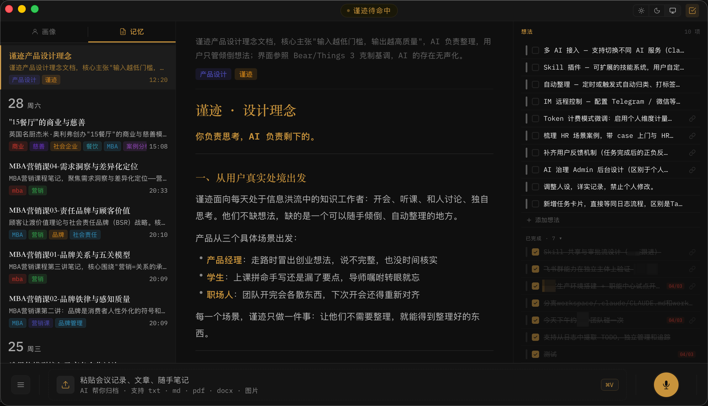

# 谨迹

[English](README.md)

你负责思考，AI 负责剩下的。

谨迹是一款 macOS 桌面应用，面向知识工作者的 AI 知识库。你不写笔记——你只管扔原始资料进来，AI 替你编译成可检索的知识条目，沿时间线自动积累为你的个人记忆体系。

## 设计理念

Andrej Karpathy [写过](https://karpathy.bearblog.dev/the-append-and-review-note/) 一种笔记原则：**先追加，后回顾**。边记边整理的摩擦感会扼杀思维，价值在于回顾的循环，而非当下的结构。

谨迹把这个理念推到极致：**你不需要写任何笔记**。录音、文档、文字粘贴——所有原始资料进入 `raw/`，LLM 增量编译为结构化的 Markdown 知识条目。每次新增资料，知识库自动更新。你要做的只有两件事：扔资料进来，之后回来阅读。

```
原始资料（录音 / 文档 / 文本）
  ↓  LLM 增量编译
记忆（时间线 .md 知识条目）
  ↓  检索 + 使用
你的问题得到解答
```

## 功能



- **语音录音** — 一键开始，自动降噪、去除静默，转为 M4A。AI 自动转写并结构化。
- **文件导入** — 拖入 PDF、DOCX、TXT，AI 提取、摘要、归档。
- **粘贴文字** — 会议摘要、网页内容、随手笔记，提交即走。
- **AI 编译** — LLM 将原始资料增量编译为结构化 Markdown：标题、标签、摘要、正文。每次新增资料自动更新知识库。
- **时间线记忆** — 所有知识条目按时间线自动排列，形成持续积累的个人记忆体系。
- **素材溯源** — 每条日志都关联回原始素材。点击素材标签即可打开源文件。
- **画像系统** — 为人物、项目、概念建立画像，辅助 AI 更精准地理解上下文和关联关系。
- **想法捕捉** — 随时记录灵感和想法。想深入探讨时，右键点击「深入探讨」，在终端中启动 AI 头脑风暴。
- **自动整理** — 定时维护知识库：矛盾检测、孤立画像清理、概念抽取、信息补全。
- **待办事项** — 从日志中捕捉行动项，按工作区路径分组，设置截止日期，深入探讨想法。
- **声纹档案** — 设备端说话人识别。命名一次，AI 之后用你起的名字。
- **沉浸阅读** — Markdown 渲染，代码高亮，左列表右详情布局，分页加载时间线。
- **@引用** — 右键任何条目或画像，快速插入 @引用到输入框。
- **飞书桥接** — 通过 WebSocket 连接飞书，接收消息并作为日志素材处理。
- **多 Workspace** — 按月份归档，支持自定义工作区路径。
- **深色 / 浅色主题** — 系统跟随，也可手动切换。琥珀金强调色，墨水青中性色调。
- **语音引擎** — Apple 原生（零配置）、WhisperKit（本地离线）、DashScope（云端）。

## 快速上手

1. 从 [Releases](https://github.com/quan2005/journal/releases) 下载最新 `.dmg`，拖入应用程序
2. 安装 [Claude CLI](https://claude.ai/download)，确保 `claude` 命令可用
3. 打开谨迹，在设置中配置工作区路径，开始录音或导入文件

## Roadmap

- [x] **想法捕捉** — 随时记录想法，右键「深入探讨」即可让 AI 展开分析
- [x] **自动整理** — 定时维护知识库，矛盾检测、信息补全
- [x] **飞书桥接** — 通过 WebSocket 接收飞书消息作为日志素材
- [ ] **多 AI 接入** — 支持切换不同 AI 服务（Claude、OpenAI、本地模型等）
- [ ] **Skill 插件** — 可扩展的技能系统，用户自定义处理流程
- [ ] **IM 远程控制** — 配置 Telegram / 微信等聊天工具，随时随地发消息触发录音、查询日志、添加待办

## 技术栈

| 层 | 技术 |
|---|---|
| 桌面框架 | Tauri v2 |
| 前端 | React 19 + TypeScript + Vite |
| 音频采集 | cpal 0.17 |
| 音频处理 | nnnoiseless（降噪）+ rubato（重采样）+ afconvert（M4A）|
| AI 处理 | Claude CLI（外部进程）|
| IM 集成 | 飞书 WebSocket 桥接 |
| 序列化 | serde / serde_json |

## 架构

```
用户操作（录音 / 拖文件 / 粘贴 / 飞书消息）
  → Frontend invoke() → src/lib/tauri.ts
  → Rust 命令处理 → workspace/yyMM/raw/ 写入原始材料
  → 启动 Claude CLI → 生成 workspace/yyMM/DD-title.md
  → 发出 journal-updated 事件
  → Frontend useJournal hook 重新加载条目
```

```
src/                     # 前端
  components/            # React 组件
  hooks/                 # useJournal, useRecorder, useTheme, useTodos
  lib/tauri.ts           # 所有 IPC 调用封装
  types.ts               # 共享类型
src-tauri/src/           # Rust 后端
  ai_processor.rs        # 调用 Claude CLI，发出事件
  recorder.rs            # 录音控制
  audio_process.rs       # 降噪 / 重采样 / 去静默
  journal.rs             # 日志条目扫描与解析
  config.rs              # 应用配置读写
  workspace.rs           # 工作区路径工具函数
  identity.rs            # 画像管理（人物、项目、概念）
  todos.rs               # 待办事项，支持路径分组
  brainstorm.rs          # 终端 AI 头脑风暴会话
  auto_lint.rs           # 定时知识库维护
  feishu_bridge.rs       # 飞书 WebSocket 客户端
  speaker_profiles.rs    # 设备端说话人识别
  materials.rs           # 文件导入与文字粘贴
  workspace_settings.rs  # 工作区设置（主题、自动整理）
```

## 本地开发

**前置依赖**：Rust stable、Node.js 18+、macOS 12+

```bash
npm install
npm run tauri dev        # 启动开发模式（Vite + Tauri 热重载）
npm test                 # 前端测试（vitest）
cd src-tauri && cargo test   # Rust 单元测试
npm run tauri build      # 构建产物 → src-tauri/target/release/bundle/
```

首次运行需授权麦克风权限：系统设置 → 隐私与安全性 → 麦克风。
