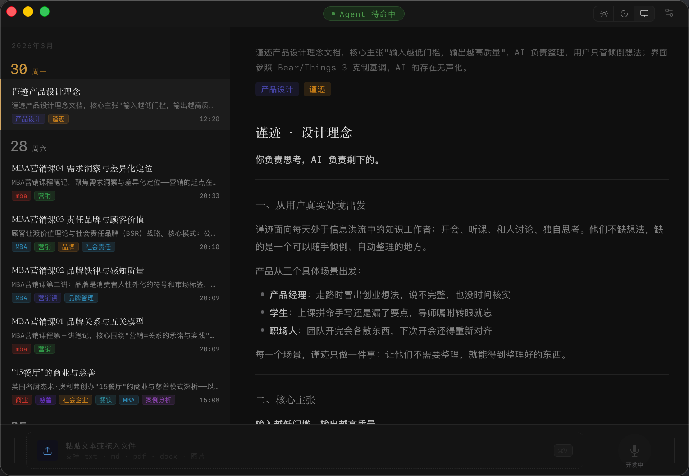

# 谨迹

[English](README.md)

你负责思考，AI 负责剩下的。

谨迹是一款 macOS 桌面应用，帮助知识工作者把录音、文件、随手记录变成整理好的日志。输入越低门槛，输出越高质量。

## 设计理念

Andrej Karpathy [写过](https://karpathy.bearblog.dev/the-append-and-review-note/) 一种笔记原则：**先追加，后回顾**。边记边整理的摩擦感会扼杀思维，价值在于回顾的循环，而非当下的结构。

谨迹正是基于此而建：**先捕捉，AI 来整理**。一键开始录音，一次粘贴提交文档，一个拖拽处理文件。你永远不需要动手整理文件夹。

输出——可搜索、带标签、关联人物的日志条目——自动出现。你之后回来阅读。

## 功能



- **语音录音** — 一键开始，自动降噪、去除静默，转为 M4A。AI 自动转写并结构化。
- **文件导入** — 拖入 PDF、DOCX、TXT，AI 提取、摘要、归档。
- **粘贴文字** — 会议摘要、网页内容、随手笔记，提交即走。
- **AI 整理** — Claude CLI 生成结构化 Markdown：标题、标签、摘要、正文。
- **声纹档案** — 设备端说话人识别。命名一次，AI 之后用你起的名字。
- **沉浸阅读** — Markdown 渲染，代码高亮，左列表右详情布局。
- **多 Workspace** — 按月份归档，支持自定义工作区路径。
- **深色 / 浅色主题** — 系统跟随，也可手动切换。
- **语音引擎** — Apple 原生（零配置）、WhisperKit（本地离线）、DashScope（云端）。

## 快速上手

1. 从 [Releases](https://github.com/quan2005/journal/releases) 下载最新 `.dmg`，拖入应用程序
2. 安装 [Claude CLI](https://claude.ai/download)，确保 `claude` 命令可用
3. 打开谨迹，在设置中配置工作区路径，开始录音或导入文件

## Roadmap

- [ ] **待办清单** — 从日志中提取 TODO，独立管理和追踪
- [ ] **多 AI 接入** — 支持切换不同 AI 服务（Claude、OpenAI、本地模型等）
- [ ] **Skill 插件** — 可扩展的技能系统，用户自定义处理流程
- [ ] **自动整理** — 定时或触发式自动归类、打标签、生成摘要
- [ ] **对话式交互** — 从单向处理改为聊天界面，支持追问和迭代优化
- [ ] **IM 远程控制** — 配置 Telegram / 微信等聊天工具，随时随地发消息触发录音、查询日志、添加待办

## 技术栈

| 层 | 技术 |
|---|---|
| 桌面框架 | Tauri v2 |
| 前端 | React 19 + TypeScript + Vite |
| 音频采集 | cpal 0.17 |
| 音频处理 | nnnoiseless（降噪）+ rubato（重采样）+ afconvert（M4A）|
| AI 处理 | Claude CLI（外部进程）|
| 序列化 | serde / serde_json |

## 架构

```
用户操作（录音 / 拖文件 / 粘贴）
  → Frontend invoke() → src/lib/tauri.ts
  → Rust 命令处理 → workspace/yyMM/raw/ 写入原始材料
  → 启动 Claude CLI → 生成 workspace/yyMM/DD-title.md
  → 发出 journal-updated 事件
  → Frontend useJournal hook 重新加载条目
```

```
src/                     # 前端
  components/            # React 组件
  hooks/                 # useJournal, useRecorder, useTheme
  lib/tauri.ts           # 所有 IPC 调用封装
  types.ts               # 共享类型
src-tauri/src/           # Rust 后端
  ai_processor.rs        # 调用 Claude CLI，发出事件
  recorder.rs            # 录音控制
  audio_process.rs       # 降噪 / 重采样 / 去静默
  journal.rs             # 日志条目扫描与解析
  config.rs              # 应用配置读写
  workspace.rs           # 工作区路径工具函数
```

## 本地开发

**前置依赖**：Rust stable、Node.js 18+、macOS 12+

```bash
npm install
npm run tauri dev        # 启动开发模式（Vite + Tauri 热重载）
npm test                 # 前端测试（vitest）
cd src-tauri && cargo test   # Rust 单元测试
npm run tauri build      # 构建产物 → src-tauri/target/release/bundle/
```

首次运行需授权麦克风权限：系统设置 → 隐私与安全性 → 麦克风。
