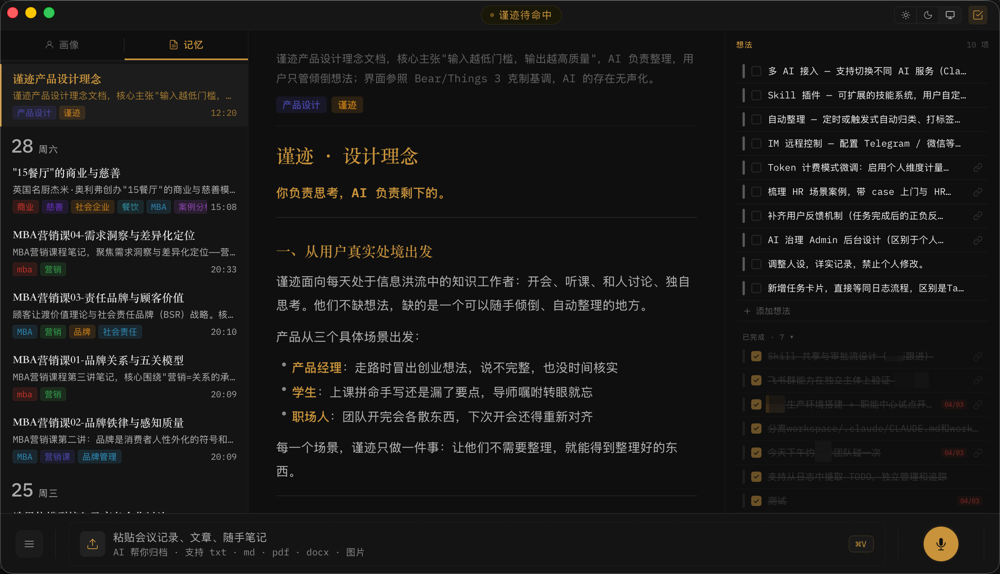

# 谨迹

[English](README.md)

你负责思考，AI 负责剩下的。

谨迹是一款 macOS 桌面应用，面向知识工作者的 AI 知识库。你不写笔记——你只管扔原始资料进来，AI 替你编译成可检索的知识条目，沿时间线自动积累为你的个人记忆体系。

## 设计理念

Andrej Karpathy [写过](https://karpathy.bearblog.dev/the-append-and-review-note/) 一种笔记原则：**先追加，后回顾**。边记边整理的摩擦感会扼杀思维，价值在于回顾的循环，而非当下的结构。

谨迹把这个理念推到极致：**你不需要写任何笔记**。文档、文字粘贴——所有原始资料进入 `raw/`，LLM 增量编译为结构化的 Markdown 知识条目。每次新增资料，知识库自动更新。你要做的只有两件事：扔资料进来，之后回来阅读。

```
原始资料（文档 / 文本）
  ↓  LLM 增量编译
记忆（时间线 .md 知识条目）
  ↓  检索 + 使用
你的问题得到解答
```

## 功能



- **文件导入** — 拖入 PDF、DOCX、TXT，AI 提取、摘要、归档。
- **粘贴文字** — 会议摘要、网页内容、随手笔记，提交即走。
- **AI 编译** — 内置 LLM 引擎将原始资料增量编译为结构化 Markdown：标题、标签、摘要、正文。每次新增资料自动更新知识库。
- **对话** — 聊天或 Agent 模式。向知识库提问，获取 AI 流式分析回答。
- **时间线记忆** — 所有知识条目按时间线自动排列，形成持续积累的个人记忆体系。
- **素材溯源** — 每条日志都关联回原始素材。点击素材标签即可打开源文件。
- **画像系统** — 为人物、项目、概念建立画像，辅助 AI 更精准地理解上下文和关联关系。
- **自动整理** — 定时维护知识库：矛盾检测、孤立画像清理、概念抽取、信息补全。
- **待办事项** — 从日志中捕捉行动项，按工作区路径分组，设置截止日期，关联会话。
- **沉浸阅读** — Markdown 渲染，代码高亮，左列表右详情布局，分页加载时间线。
- **@引用** — 右键任何条目或画像，快速插入 @引用到输入框。
- **技能插件** — 通过 workspace 或全局 `~/.claude/skills/` 中的 `SKILL.md` 文件扩展处理流程。
- **飞书桥接** — 通过 WebSocket 连接飞书，接收消息并作为日志素材处理。
- **多 Workspace** — 按月份归档，支持自定义工作区路径。
- **深色 / 浅色主题** — 系统跟随，也可手动切换。琥珀金强调色，墨水青中性色调。
- **多厂商 AI** — 支持 Anthropic、火山方舟、智谱 AI、阿里云百炼作为 LLM 提供商。

## 快速上手

1. 从 [Releases](https://github.com/quan2005/journal/releases) 下载最新 `.dmg`，拖入应用程序
2. 打开谨迹，在设置 → AI 引擎中配置 AI 提供商（Anthropic API Key，或国内厂商）
3. 设置工作区路径，导入文件或粘贴文字

## Roadmap

- [x] **对话** — 聊天和 Agent 模式，流式 AI 回答
- [x] **自动整理** — 定时维护知识库，矛盾检测、信息补全
- [x] **飞书桥接** — 通过 WebSocket 接收飞书消息作为日志素材
- [x] **多厂商 AI** — Anthropic、火山方舟、智谱、百炼作为 LLM 提供商
- [x] **技能插件** — 通过 SKILL.md 扩展处理流程
- [ ] **IM 远程控制** — 配置 Telegram / 微信等聊天工具，随时随地发消息提交素材、查询日志、添加待办

## 技术栈

| 层           | 技术                              |
| ------------ | --------------------------------- |
| 桌面框架     | Electron                          |
| 前端         | React 19 + TypeScript + Vite 7    |
| 后端         | TypeScript daemon（HTTP + SSE）   |
| AI 引擎      | daemon pi 内建引擎 + CLI adapters |
| 文件变更     | ChangeSet service                 |
| 桌面宿主能力 | Electron preload host bridge      |

## 架构

```
用户操作（拖文件 / 粘贴 / Agent Run）
  → React 前端 → runtimeClient / hostBridge
  → TypeScript daemon services（HTTP + SSE）
  → workspace 文件 / ChangeSet / AgentRunEvent
  → 前端 hooks 订阅事件并刷新视图
```

```
apps/web/src/            # React 前端
  components/            # React 组件
  hooks/                 # useJournal, useTheme, useIdentity, useTodos, useConversation
  lib/runtimeClient.ts   # daemon runtime 抽象
  lib/hostBridge.ts      # Electron host 能力
apps/daemon/src/         # TypeScript daemon
  server.ts              # HTTP/SSE routes
  engine/                # pi 内建引擎
  runs/                  # Agent Run 生命周期
  changeset/             # 文件变更记录与恢复
  journal/ todos/ topics/ identity/
apps/desktop/src/        # Electron host
  main.ts                # 窗口与应用生命周期
  daemon.ts              # daemon 子进程生命周期
  hostIpc.ts             # preload 白名单 IPC
```

## 本地开发

**前置依赖**：Node.js 20+、bun 1.1+

```bash
bun install
npm run desktop:dev      # 启动桌面开发模式（Vite + Electron）
npm test                 # 前端测试（vitest）
cd apps/daemon && bunx vitest run
cd apps/desktop && bunx vitest run
npm run test:e2e         # E2E 测试（Playwright）
npm run desktop:build    # Electron 生产构建
```

## 文档

- [用户指南](docs/guide/quick-start.md) — 安装、导入、对话、时间线
- [开发者指南](docs/dev/index.md) — 环境搭建、架构、前后端开发、构建与发布
- [设计系统](docs/DESIGN.md) — 配色、排版、组件、布局、动画
- [架构文档 (ARCH.md)](docs/ARCH.md) — 完整架构文档
- [llms.txt](llms.txt) — 面向 AI Agent 的机读文档索引
