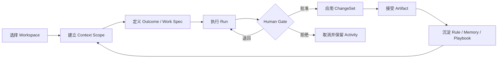
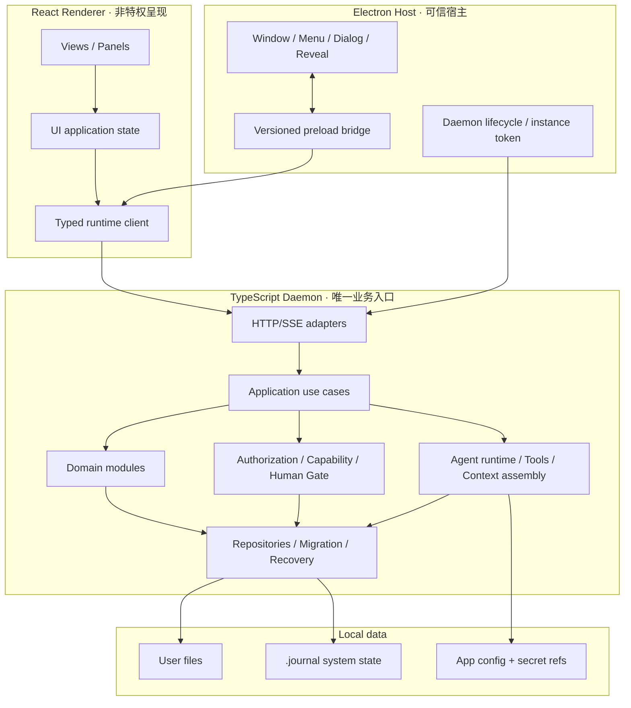
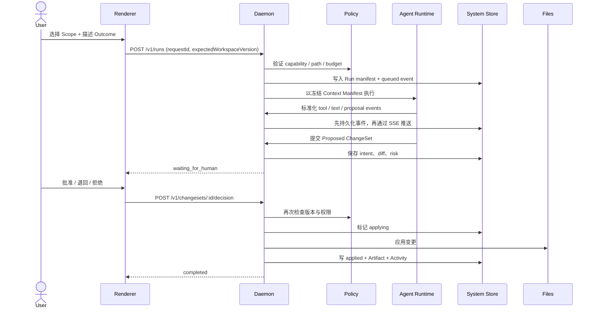

# JournalClaw

# 本地个人 Agentic Workspace · System Design v0.1

> **状态：** Draft / 待共同决策  
> **Owner：** Yanwu  
> **协作整理：** Codex  
> **最后更新：** 2026-07-30  
> **适用范围：** 仅本地 Desktop、单用户、个人效率；从当前实现渐进迁移，不做大爆炸重写

| 项目 | 内容 |
|---|---|
| Authors | Yanwu、Codex |
| Reviewers | 待定 |
| Related docs | `docs/ARCH.md`、`docs/final-state.md`、`docs/CONVENTIONS.md`、`Moxt-深度复刻分析报告.md` |
| Scope | 重新建立 JournalClaw 的业务本体、技术边界、数据与执行契约、信任机制及渐进迁移路线 |

## 如何阅读这份文档

文中使用四种标签，避免把愿景误写成事实：

- **[现状]**：已由当前仓库代码或权威文档验证。
- **[决策]**：建议成为后续实现必须遵守的架构约束。
- **[提案]**：方向明确，但实现选型或指标仍需验证。
- **[开放]**：需要 Yanwu 参与拍板，不能由实现者擅自决定。

这不是一次性“终局蓝图”。它是后续每个 story、ADR、实现与验收共同使用的决策基线。只有 `[决策]` 且进入权威文档或 ADR 的内容，才对代码具有约束力。

---

## 1. 摘要

JournalClaw 不应复刻 Moxt 的团队、云协作和商业平台，而应吸收其真正有效的因果链：

> **本地文件资产 → 有界上下文 → 窄职责 Agent → 可恢复执行 → 用户确认变更 → 可追溯产物**

产品的核心不是聊天，也不是功能导航，而是一条可被验证的个人工作闭环：

1. 用户选择一个本地 Workspace 与明确的 Context Scope；
2. 用户描述目标，系统形成可检查的 Work Spec；
3. Agent 在受限工具和预算内执行，Run 全程可见、可暂停、可恢复；
4. 所有文件变更先形成 ChangeSet，由用户审阅后应用；
5. 结果以 Artifact 落到明确路径，并能追溯 Sources、Run、工具与变更；
6. 经用户确认的经验沉淀为 Rule / Memory / Playbook，供下一次复用。

**[决策] 架构形态继续采用本地模块化单体：**

- Electron 只负责可信桌面宿主能力；
- React Renderer 只负责呈现与交互；
- TypeScript Daemon 承担全部业务用例、领域规则、授权与持久化；
- `packages/contracts` 是跨进程契约唯一来源；
- 用户文件是长期资产，`.journal/` 是系统状态唯一命名空间；
- AI 引擎是可替换的基础设施适配器，不能定义业务对象。

**[决策] 迁移不以“重写完成”为成功，而以可信的纵向闭环逐段替换。** 第一条纵向闭环是：

`Workspace → Context Manifest → Run → ChangeSet Review → Artifact → Activity → 冷启动恢复`

---

## 2. Goals and Non-Goals

| Goals | Non-goals |
|---|---|
| G1. 让一次个人任务从上下文选择到产物落盘全程可见、可审、可恢复 | NG1. 不做多租户、组织、席位、邀请、团队 RBAC |
| G2. 五个一等对象在同一 Workspace 内可持久化、冷启动恢复、导出与追溯 | NG2. 不做云端实时协同、公共可编辑分享或评论线程 |
| G3. 文件写入、外部动作和敏感工具默认最小权限，并有明确 Human Gate | NG3. 不把 MiniApp 云数据库、部署与登录平台作为核心能力 |
| G4. 业务边界由代码结构、契约与自动化测试共同强制，不再依赖口头约定 | NG4. 不以多 Agent 数量、角色拟人化或组织模拟作为产品目标 |
| G5. 每个阶段都能独立交付用户价值、回滚且不破坏现有主路径 | NG5. 不为追求“架构纯度”一次性替换 Electron、React、TS daemon 或 pi |
| G6. 本地数据可备份、迁移、重建索引，升级失败不损坏用户文件 | NG6. 不把营销站、模板市场、Credits、国际化纳入本轮架构 |
| G7. 维护者从一个入口两跳内找到唯一规则，并能发现代码/文档漂移 | NG7. 不在第一阶段接入 Browser Operator 或任意默认外部写自动化 |

### 2.1 成功指标

以下均为 **[提案]**，需在 M0 建立基线后调整：

- 主闭环任务的“首次执行成功并得到可用 Artifact”比例 ≥ 90%。
- 已批准 ChangeSet 在进程崩溃或应用重启后不丢失，恢复演练通过率 100%。
- 任一 Artifact 可在 3 次交互内反查 Source、Run、ChangeSet 与 Activity。
- `workspace_write` 模式下，越界写入的自动化测试阻断率 100%。
- daemon 重启后，Run / Artifact / Source / Memory / ChangeSet 的恢复验收通过率 100%。
- 后续连续 10 个 story 的架构门禁一次通过率 ≥ 80%。

---

## 3. Background and Problem Statement

### 3.1 值得保留的现有资产

**[现状]** 当前产品北极星仍然正确：本地优先、文件是长期资产、Agent 是执行者、输出是核心结果。以下资产应保留：

- Electron Host / React Renderer / TypeScript Daemon 三层拆分；
- 业务能力经 `runtimeClient`、宿主能力经 `hostBridge` 的双入口原则；
- desktop 零业务语义、preload 白名单、`contextIsolation`、`nodeIntegration: false` 与 sandbox；
- `.journal/` 作为系统命名空间的目标；
- pi 引擎适配、统一 `AgentRunEvent`、daemon-owned tools；
- ChangeSet、授权模式、可恢复删除等信任概念；
- `Sources → Run → Artifact / Memory / ChangeSet` 的 provenance 方向；
- `packages/contracts` 作为跨端契约唯一来源；
- vitest / Playwright、ESLint 架构护栏、story / verification / docs gates。

### 3.2 当前腐化不是“代码太多”，而是边界失去执行力

**[现状] 仓库审计发现：**

| 严重度 | 腐化信号 | 影响 |
|---|---|---|
| P0 | `workspace_write` 下 bash 没有可靠路径约束，也不会逐操作生成 ChangeSet | Agent 可越界写入，授权语义失真 |
| P0 | Run 执行与 ChangeSet 查询/回滚使用不同 service 实例 | UI 可能看不到真实变更，也无法可靠回滚 |
| P1 | Run 元数据、SourceBinding、Artifact、Memory、ChangeSet 多数仅存在内存 Map | 重启后“一等对象”消失，JSONL 也无法直接恢复 |
| P1 | daemon 全局单例、workspace 缓存和按请求创建 service 三种生命周期混用 | 跨 Workspace 泄漏、错误路径写入和状态不一致 |
| P1 | AgentRun 绕过统一 runtime client，前端还复制一份 contracts 类型 | 双客户端、双契约源，后续修改必然漂移 |
| P1 | `docs/ARCH.md` 同时写“CLI 已删除”和“CLI EngineSwitcher 仍存在” | 权威文档无法再作为事实入口 |
| P1 | 状态散落于 `.journal/`、`.setting.json`、`.conversations/`、`.Codex/`、`.work_queue.json`、`.journal-daemon-data/` | 备份、迁移、导出和恢复无法形成单一契约 |
| P1 | `server.ts` 约 2096 行，`httpRuntimeClient.ts` 约 1053 行，`App.tsx` 约 1402 行 | route/UI 入口承载编排语义，模块规则难以强制 |
| P1 | 固定端口 daemon 只有健康检查，无每次启动的实例身份 | Electron 可能误连旧进程，本地其他进程也可调用业务 API |
| P1 | 产品导航对象与“五个一等对象”形成双重产品本体 | 用户心智、领域模型和代码模块无法对齐 |

### 3.3 问题定义

过去的治理主要完成了技术栈迁移和文档整理，但没有把以下三件事同时闭环：

1. **业务本体闭环**：用户到底围绕哪些对象工作，导航、状态与持久化是否一致；
2. **信任闭环**：Agent 看了什么、为什么这样做、改了什么、能否恢复；
3. **治理闭环**：架构规则能否由依赖、契约、测试和迁移机制自动执行。

如果继续在当前边界上叠加功能，新增能力会同时复制到 route switch、HTTP client switch、前端状态、内存 service 和文档，维护成本呈乘法增长。

### 3.4 架构北极星与三条不变量

> **北极星：让个人把一个真实目标交给本地 Agent，得到位于正确路径、可审阅、可追溯、可复用的结果。**

**[决策] 三条不变量：**

1. **资产不变量**：用户内容以普通文件为长期资产；系统索引可以重建，不能成为唯一内容真相。
2. **执行不变量**：任何副作用都必须由 daemon 在明确 Workspace、Capability、Authorization 与 ChangeSet/Activity 上下文中执行。
3. **证据不变量**：每个被接受的 Artifact、Memory 和外部动作都必须能反查输入来源、Run、执行版本与用户关口。

---

## 4. Proposed Architecture

### 4.1 业务架构：一个核心循环，而不是一组页面



这个循环映射为六个用户阶段：

| 阶段 | 用户要回答的问题 | 系统责任 |
|---|---|---|
| Context | 这次 Agent 可以看什么？ | 显式范围、来源、版本、预算 |
| Intent | 我最终要得到什么？ | Work Spec、完成条件、输出路径 |
| Execute | 它正在做什么、卡在哪里？ | Run、工具、进度、等待原因 |
| Review | 它准备改什么？ | ChangeSet、diff、风险、审批 |
| Result | 最终结果在哪里、是否可用？ | Artifact、验证、版本、引用 |
| Learn | 下次怎样少解释一次？ | Rule / Memory / Playbook 的确认、修剪与复用 |

### 4.2 核心业务对象

**[决策] 保留当前五个一等对象，但补齐三个“信任原语”和两个“复用对象”。**

| 类型 | 对象 | 核心职责 | Source of truth |
|---|---|---|---|
| 核心 | Workspace | 一个本地工作边界，包含目标、根路径与系统状态 | Workspace 根 + `.journal/workspace.json` |
| 核心 | Source / Context Manifest | 某次 Run 实际可见和实际使用的文件、版本与片段 | Run 冻结的 manifest |
| 核心 | Run | 一次可恢复、可取消、有预算的执行 | durable Run repository + event log |
| 核心 | Artifact | 用户可消费、可接受、可替换的最终结果 | 用户文件 + artifact metadata |
| 核心 | Rule / Memory | 经审阅、带证据、可过期的长期上下文 | `.journal/memory/` + metadata |
| 信任 | ChangeSet | 一组待审或已应用的文件变更与恢复材料 | durable ChangeSet repository |
| 信任 | Activity | 用户、Agent、工具与系统发生过的状态变化 | append-only activity/event log |
| 信任 | Capability Grant | 主体在范围、时间与动作上的最小权限 | policy + per-run snapshot |
| 复用 | Agent Profile | 一个窄职责 Agent 的 Goal、Rules、Skills、Memory policy、Tools | versioned profile |
| 复用 | Playbook | 可重复运行的步骤、输入、完成条件、审批点和失败策略 | versioned playbook |

**[决策] Journal、Todo、Identity、Skill、Automation 不再与核心对象平行竞争：**

- Journal 是用户文件/Memory 的时间视图；
- Todo 是 Work Spec / Playbook Step 的轻量视图；
- Identity 是个人 Agent Profile 与偏好的管理视图；
- Skill 是 Agent Profile 可引用的能力包；
- Automation 是 Playbook 的触发方式；
- Conversation 是 Intent 与 Run 的交互界面，不是长期结果的默认容器。

### 4.3 能力分层

| 层级 | 能力 | 进入条件 |
|---|---|---|
| L0 可信地基 | Workspace、Files、Version、Context Manifest、Run、ChangeSet、Artifact、Activity、Recovery | 没有它就不开放自动化 |
| L1 个人 Agent | Agent Profile、Rules、Memory Review、Skills、模型与预算策略 | L0 可追溯、可恢复 |
| L2 可复用工作 | Work Spec、Playbook、Human Gate、Checkpoint、按需运行 | 单次主闭环稳定 |
| L3 持续运行 | Local Schedule、on-wake catch-up、有限 Integration、通知 | 幂等、重试、暂停与审计完成 |
| 延后 | 多 Agent 编排、Browser Operator、MiniApp、广泛连接器 | 只有真实个人场景连续验证后才立项 |

### 4.4 技术架构：本地模块化单体



### 4.5 依赖方向

**[决策] 依赖只能从外向内：**

`UI / API adapters → application use cases → domain → ports`

`infrastructure adapters → domain ports`

领域层不得 import Electron、Express、React、pi、文件系统具体实现或某个模型 SDK。

**[决策] 三个 composition root：**

1. `apps/desktop`：构造窗口、preload bridge 与 daemon 进程；
2. `apps/web`：构造 typed runtime client 和 UI；
3. `apps/daemon`：按 Workspace 构造唯一 `WorkspaceRuntime`，内部拥有同生命周期的 repositories、services、policy 和 run coordinator。

任何业务服务不得用 `process.cwd()` 猜 Workspace；任何 Workspace 数据不得放在 daemon 全局单例。

### 4.6 Daemon 目标模块

| Component | Responsibility | Primary storage | Failure behavior |
|---|---|---|---|
| Workspace Runtime Registry | 打开、切换、关闭 Workspace；保证 service/repository 同生命周期 | app config + workspace manifest | 打开失败则拒绝业务命令，不回退到 cwd |
| Context Service | 生成并冻结 Context Manifest，记录来源版本与预算 | `.journal/runs/<id>/context.json` | 缺失或越界来源时 fail closed |
| Run Coordinator | 创建、恢复、取消 Run；驱动状态机与事件 | run repository + JSONL events | 可重放；未知状态进入 recovery_required |
| Policy & Capability Service | 授权路径、工具、网络、预算和 Human Gate | policy snapshot + activity | 无法判定时拒绝，不静默放行 |
| Change Service | 先记录 intent，再执行文件变更，支持回滚与对账 | changes repository + recovery stash | 部分失败进入 needs_recovery，禁止假成功 |
| Artifact Service | 接受、索引、验证、替换 Artifact | 用户文件 + artifact metadata | 元数据可从文件/Run 重建 |
| Memory Service | 提议、审阅、过期、修剪、引用长期记忆 | `.journal/memory/` + metadata | 未审阅记忆不进入 durable context |
| Playbook Service | 管理版本化 Work Spec、Steps、Gates、失败策略 | `.journal/playbooks/` | 旧 Run 固定使用启动时版本 |
| Activity Service | 记录 actor、动作、原因、版本、结果和错误 | append-only event log | 写入失败则阻止关键副作用 |
| Integration Adapters | 模型、受限网络或未来外部系统连接 | secret refs + adapter config | 超时/重试受预算约束，默认不执行外部写 |

### 4.7 数据架构

**[决策] 数据按“可读资产、系统账本、可重建索引、设备配置”分层：**

```text
<workspace>/
├── <用户目录与文件>                 # canonical user content
└── .journal/
    ├── workspace.json               # 版本化 workspace manifest
    ├── runs/<run-id>/
    │   ├── manifest.json             # Run 固定输入、版本、预算、profile/playbook 版本
    │   ├── context.json              # 实际上下文清单与 digest
    │   └── events.jsonl              # append-only 执行证据
    ├── changes/<changeset-id>/       # intent、diff、备份与恢复状态
    ├── memory/                       # 经审阅的长期记忆与规则
    ├── profiles/                     # Agent Profile
    ├── playbooks/                    # 可复用工作定义
    ├── activity/                     # append-only activity segments
    ├── index/                        # 可删除、可重建的派生索引
    ├── trash/                        # 可恢复删除
    └── schema.json                   # disk schema version / migration history
```

**[提案] 事务性元数据可引入单文件 SQLite System Store，但不立即替换现有 JSONL。**

- 用户文件仍是长期资产；
- Run events / Activity 仍保留可导出、可重放的 append-only 表达；
- SQLite 只承担对象索引、状态、幂等键、引用关系和迁移账本；
- 实现前先验证 Electron 打包、跨平台原生依赖、备份与损坏恢复；
- 若供应链或打包风险不可接受，先用版本化 JSON repositories 实现同一 port。

SQLite 官方文档说明事务可提供原子提交，即使操作系统崩溃或断电也能保持“全部发生或全部不发生”的语义；这适合本地系统元数据，但不能让跨数据库与普通文件的写入天然成为一个事务，因此仍需要 intent log 与 reconciliation。  
参考：[SQLite Atomic Commit](https://www.sqlite.org/atomiccommit.html)。

### 4.8 Context Architecture

**[决策] Context 不是“搜索结果堆叠”，而是一份可审计的 Manifest。**

每次 Run 按固定顺序装配：

1. 系统安全不变量与工具能力；
2. Workspace 目标和范围；
3. Agent Profile 的 Goal / Rules / Skill refs；
4. 当前 Work Spec / Playbook version；
5. 用户显式选择的文件与片段；
6. 检索补充的候选来源；
7. 经审阅且未过期的 Memory；
8. 当前消息与附件。

Context Manifest 至少记录：路径、内容 digest、选入原因、来源类型、版本/mtime、字符或 token 预算、是否显式选择。Run 启动后冻结 Manifest；中途文件变化以新事件显式记录，不静默替换输入。

---

## 5. Request Lifecycle

### 5.1 交互任务主生命周期



### 5.2 Run 状态机

**[提案]**

```text
queued
  → preparing
  → running
  → waiting_for_human
  → applying
  → completed

任一非终态 → failed | cancelled
异常恢复态 → recovery_required → running | failed | cancelled
```

规则：

- 状态迁移只能由 Run Coordinator 执行；
- 每次迁移先写 durable event，再通知 UI；
- `waiting_for_human` 必须携带明确 decision schema；
- 终态不可反向修改；重试创建新 attempt，并保留 parent run；
- 取消只保证停止未来动作，已完成的副作用通过补偿或 ChangeSet revert 处理。

### 5.3 ChangeSet 状态机

```text
proposed → approved → applying → applied → reverted
        ↘ rejected
approved/applying → failed → needs_recovery → applied | reverted
```

文件 mutation 顺序：

1. 解析并规范化目标路径；
2. 在 daemon 依据真实路径检查 Workspace 边界；
3. 计算 expected version / digest；
4. 写入 intent、before snapshot 与 Activity；
5. 获得 Human Gate（若策略要求）；
6. 使用临时文件或恢复材料执行；
7. 校验结果 digest；
8. 写入 applied event 与 Artifact reference；
9. 崩溃后由 reconciliation 扫描非终态 ChangeSet。

**[决策] bash 不能继承模糊的 `workspace_write`。** 第一阶段应默认禁用任意 shell 写入；后续若保留 shell，只能通过受控工作目录、命令能力清单、OS sandbox 或等价强约束执行。无法解析的复合命令不得因“看起来在 workspace 内”而放行。

### 5.4 Automation 生命周期

Automation 只是 Playbook 的触发器：

`scheduled / event / on-wake → dedupe → Run → Human Gate → result`

必须具备：幂等键、错过执行策略、最大重试、退避、超时、暂停、下一次运行时间、失败队列和人工接管。L0-L2 未稳定前，不开放默认外部写 Automation。

---

## 6. API and Data Contracts

### 6.1 API 边界

**[决策]**

- Renderer 业务请求只经 `JournalRuntimeClient`；
- Host 能力只经版本化 `hostBridge`；
- AgentRun 不再维护独立 `fetch/EventSource` 客户端；
- API 以 `/v1` 明确版本；
- HTTP 负责 command/query，SSE 只负责可恢复事件流；
- 所有 payload、error、event 在 `packages/contracts` 定义并运行时校验；
- TypeScript 类型不能替代不可信边界的运行时验证。

建议的最小 API：

| Method | Endpoint | Purpose |
|---|---|---|
| POST | `/v1/workspaces/open` | 打开并验证 Workspace，返回 instance/workspace version |
| GET | `/v1/workspaces/current` | 获取当前 Workspace 与健康状态 |
| POST | `/v1/runs` | 创建 Run，要求 requestId、scope、outcome、authorization |
| GET | `/v1/runs/:id` | 获取可恢复状态与当前 version |
| GET | `/v1/runs/:id/events?after=` | SSE cursor resume |
| POST | `/v1/runs/:id/cancel` | 幂等取消 |
| GET | `/v1/runs/:id/changesets` | 查询与该 Run 同 repository 的变更 |
| POST | `/v1/changesets/:id/decision` | approve / reject / request_changes |
| POST | `/v1/changesets/:id/revert` | 受策略保护的回滚 |
| GET | `/v1/artifacts/:id` | Artifact 与 provenance |
| POST | `/v1/memory/:id/review` | accept / edit / reject / expire |

### 6.2 Command Envelope

```json
{
  "requestId": "stable-id",
  "workspaceId": "stable-id",
  "expectedWorkspaceVersion": 12,
  "actor": { "type": "user", "id": "local-owner" },
  "payload": {},
  "client": { "contractVersion": "1", "appVersion": "0.x" }
}
```

### 6.3 Event Envelope

| Field | Type | Required | Description |
|---|---|---|---|
| eventId | string | Yes | Workspace 内单调可排序的事件标识 |
| runId | string | Conditional | Run 相关事件必填 |
| sequence | integer | Yes | 同一 stream 内严格递增 |
| occurredAt | ISO timestamp | Yes | 事件发生时间 |
| actor | User / Agent / Tool / System | Yes | 发起主体 |
| type | versioned string | Yes | 事件类型，不复用旧类型改变语义 |
| schemaVersion | integer | Yes | payload schema 版本 |
| causationId | string | No | 直接原因 |
| correlationId | string | Yes | 一次用户目标的相关链 |
| payload | object | Yes | 经运行时校验的事件数据 |
| redaction | object | No | 敏感字段已裁剪说明 |

JSON Schema Draft 2020-12 提供版本化结构和验证语义，可作为跨进程与落盘 payload 的契约格式；TypeScript 类型从 schema 生成或与 schema 做一致性检查，避免再次形成双真相。  
参考：[JSON Schema Draft 2020-12](https://json-schema.org/draft/2020-12)。

### 6.4 Contract guarantees

- 关键副作用前，authorization snapshot、intent 和相关 event 必须已经持久化；
- command 以 `requestId` 幂等，重复请求返回同一结果或明确冲突；
- 更新以 `expectedVersion` 防止静默覆盖；
- Run 固定记录 app、contract、profile、playbook、model、tool 与 context 版本；
- event log 是审计与恢复证据，派生 UI 状态不是 source of truth；
- Artifact 内容的长期真相是用户文件，metadata/index 可以重建；
- 未知 schema version 必须 fail closed 或进入兼容读取，不得误解释。

TypeScript 官方 Project References 可把大型 TS 程序拆成更小的逻辑项目并强化模块分组；是否采用项目引用应在模块边界稳定后验证构建与编辑器成本，而不是先制造更多配置。  
参考：[TypeScript Project References](https://www.typescriptlang.org/docs/handbook/project-references)。

---

## 7. Consistency, Idempotency, and Replay

| Scenario | Expected behavior | Reasoning |
|---|---|---|
| 重复创建 Run | 同一 requestId 返回同一 Run | 防止 UI 重试制造重复成本和副作用 |
| daemon 在应用文件前崩溃 | ChangeSet 保持 approved/applying，重启后对账 | intent 已写，不能假装完成 |
| daemon 在文件已写、状态未写时崩溃 | 用 digest/snapshot 判断 applied 或回滚，进入 recovery_required | 文件与系统账本无法天然同事务 |
| SSE 断线重连 | 客户端携带 last eventId，从下一事件恢复 | UI 不依赖内存流 |
| Workspace 文件在 Run 中途变化 | 原 Run 继续使用冻结版本或进入显式冲突 | 防止行为在中途静默变化 |
| Playbook / Profile 被修改 | 已启动 Run 使用 manifest 中固定版本 | 可重放、可解释 |
| 外部动作超时 | 先查询幂等结果，再决定重试；不能盲重放 | 超时不代表未执行 |
| 索引损坏 | 从用户文件、manifest、events 重建 | 派生索引不是长期真相 |

**[决策] 不宣称跨普通文件与 System Store 的强原子事务。** 使用 intent log、digest、幂等键与 reconciliation 提供可恢复的一致性。

---

## 8. Security and Privacy Considerations

### 8.1 Electron 边界

**[决策]**

- Renderer 保持 `nodeIntegration: false`、`contextIsolation: true`、sandbox；
- preload 只暴露逐项、可验证、版本化的方法，不暴露 raw IPC；
- 校验所有 IPC sender，限制导航、新窗口与外部链接；
- 采用严格 CSP，远程内容不进入拥有宿主能力的 Renderer；
- Markdown / HTML 预览视为不可信内容，保持 sanitization 与隔离；
- Electron 保持在受支持的稳定版本升级路径上。

Electron 官方明确建议启用 context isolation、进程 sandbox、限制导航和新窗口、验证 IPC sender，并避免向不可信内容暴露 Electron API。  
参考：[Electron Security Checklist](https://www.electronjs.org/docs/latest/tutorial/security)、[Context Isolation](https://www.electronjs.org/docs/latest/tutorial/context-isolation)。

### 8.2 Daemon 实例身份

**[提案]**

- desktop 每次启动 daemon 时生成短期 instance token；
- daemon 只监听 loopback，但不能把 loopback/CORS 当身份验证；
- `/health` 返回 instanceId、contractVersion 和 workspace-neutral 状态；
- renderer 的 typed client 从受控启动握手获得 base URL 与 token；
- Electron 只有在 instanceId 匹配时才认为 daemon 已就绪；
- 固定端口可保留开发体验，生产优先使用动态端口或端口占用时安全失败。

### 8.3 路径、工具与网络

- canonicalize 后再做 Workspace 边界判断，拒绝 symlink escape 与 `..`；
- 权限以 capability 表达：read paths、write paths、network origins、tool actions、budget、expiry；
- `read_only` / `workspace_write` / `full_access` 只是用户预设，执行时必须展开为具体 capability；
- 删除、越界写、外发、支付、凭证、权限变化必须进入 Human Gate；
- 凭证只以 secret reference 进入 Run，绝不写进 prompt、event 或普通日志；
- 外部内容带 trust label，不能因为位于 Workspace 就自动成为指令。

### 8.4 隐私

- 默认不发送与任务无关的文件；
- Context Manifest 让用户看到即将发给模型的来源范围；
- 日志默认裁剪文件正文、prompt、secret 和工具返回中的敏感数据；
- 本地模型与远程模型使用同一 provenance/authorization 语义；
- 提供按 Run 查看“发送给哪个模型、哪些来源、多少用量”的能力；
- 删除语义覆盖 user file、system metadata、cache、recovery stash 与导出副本说明。

---

## 9. Operational Readiness

| Signal | SLO / Alert（提案） | Owner | Launch gate |
|---|---|---|---|
| Desktop 启动成功率 | ≥ 99.5%；错误必须区分 Electron、daemon、workspace migration | Maintainer | Required |
| Daemon ready time | 参考设备 p95 ≤ 3s，且 instanceId 正确 | Maintainer | Required |
| 业务 API latency | 排除 AI/大文件任务后 p95 ≤ 200ms | Maintainer | Recommended |
| Run event durability | 已推送事件 100% 可在重启后读取 | Maintainer | Required |
| ChangeSet recovery | 故障注入后 100% 进入 applied / reverted / recovery_required 明确状态 | Maintainer | Required |
| 越界写阻断 | 安全测试 100% 阻断 | Maintainer | Required |
| 索引重建 | 可从 canonical files + events 重建，且引用完整性检查通过 | Maintainer | Required |
| 文档漂移 | CI 检测不存在模块、重复契约与历史能力回潮 | Maintainer | Required |

### 9.1 日志与诊断

- 结构化日志至少含 instanceId、workspaceId、correlationId、runId、component、severity；
- 默认滚动与容量上限，不能无限增长；
- 用户可一键导出脱敏诊断包；
- UI 错误提供稳定 error code、用户动作与可恢复建议；
- 开发日志和用户 Activity 分离，不能互相代替。

### 9.2 Migration

所有磁盘迁移必须：

1. 检查 schema version；
2. 创建可验证备份；
3. 幂等执行；
4. 保留未知字段；
5. 验证对象数量、digest 与引用完整性；
6. 失败时回滚或停在明确 recovery 状态；
7. 记录 migration Activity；
8. 在至少一个版本周期内双读旧格式、只写新格式，随后显式删除兼容层。

兼容层必须有 owner、移除条件和最晚删除 milestone；“先留着”不是长期状态。

### 9.3 Backup and Recovery

- 用户文件继续兼容 Git、Time Machine 或普通目录备份；
- `.journal/` 必须被纳入 Workspace 导出；
- app config 与 secret 不混入 Workspace 导出；
- 提供 `verify workspace`：schema、event sequence、dangling refs、orphan changes、index rebuild；
- 发布前进行 kill -9、断电等价故障注入、磁盘写失败、端口冲突与旧版本升级测试。

---

## 10. Alternatives Considered

| Alternative | Why it was considered | Why it was not selected |
|---|---|---|
| 大爆炸重写 | 可一次得到“干净目录” | 无法证明业务行为等价，迁移和回滚风险过大，也会暂停真实用户价值 |
| 继续按页面/功能修补 | 单次改动看起来快 | 双客户端、内存对象和超大入口会持续放大每项功能的维护成本 |
| 完整复刻 Moxt | 能得到宏大的能力地图 | 团队、多租户、MiniApp、云分享与 Credits 不服务本地单用户核心任务 |
| 纯文件、拒绝任何系统数据库 | 可读、可移植、供应链简单 | 幂等、引用、状态机和跨对象查询会重复自研事务语义；仍保留为适配器备选 |
| 全部状态放 SQLite | 事务与查询简单 | 会把用户资产锁进内部数据库，损害本地优先与可恢复性 |
| 微服务 / 多 daemon | 隔离看起来更强 | 单用户本地产品不需要分布式复杂度；先用模块化单体和进程边界 |
| 让 Agent 直接写文件 | 交互快 | 无 Human Gate、版本冲突、恢复与审计，无法形成可信工作系统 |
| 先做多 Agent / Board | 视觉上接近 AI 团队 | 在单 Run、Context、ChangeSet 未稳定前只会增加管理熵 |

---

## 11. Open Questions

以下问题按决策顺序排列，不要求一次答完。

### Q1 · 产品首页的唯一主对象是什么？

**[开放] 推荐：Workspace。** 进入一个 Workspace 后，用户围绕 Context、Run 与 Artifact 工作；Ideas、Automation、Skills、Identity 退为 Workspace 内视图或设置，而不是并列产品。

### Q2 · 用户内容与系统内容的视觉边界有多强？

**[开放]** `.journal/` 默认隐藏，还是以“系统记录”只读入口展示？推荐默认隐藏文件结构，但在产品中提供 Activity、Memory、Recovery 与 Export 的可解释入口。

### Q3 · 第一条高频真实任务是什么？

**[开放]** 必须选一个用户每周真实发生的任务作为 M1 纵向闭环，例如：

- 阅读资料 → 形成结构化研究报告；
- 整理项目文件 → 生成行动计划并更新文档；
- 从会议/想法 → 生成可执行任务与产物。

没有这个锚点，架构会再次退化成抽象能力清单。

### Q4 · SQLite 是否进入目标实现？

**[开放] 推荐先定义 `SystemStore` port，再做一周以内的 packaging/recovery spike。** 决策标准：跨平台打包、崩溃恢复、备份、性能、供应链维护成本，不以“数据库更专业”为理由。

### Q5 · Shell 的产品定位是什么？

**[开放] 推荐默认不向内置 Agent 暴露任意 shell。** 优先提供可授权、可审计的结构化 tools；确有代码任务时，以独立高风险 capability 和更强 sandbox 启用。

### Q6 · 远程模型与本地模型的默认策略？

**[开放]** 需要决定隐私默认值、模型选择入口、Context 预览与成本预算；架构上二者共享同一 Run / provenance / capability 契约。

### Q7 · 何时删除历史兼容数据路径？

**[开放]** 推荐在新 disk schema 完成双读、单写、验证和至少一次真实升级后删除；每条兼容路径单独列 migration story。

---

## 12. Decision and Next Steps

### 12.1 推荐决策

批准本 v0.1 作为“讨论基线”，但暂不把所有提案写入 `docs/ARCH.md`。先共同拍板 Q1–Q3，再进入 Requirements Gate，为第一条纵向闭环建立 approved story。

### 12.2 渐进路线

| Milestone | Deliverable | Exit criteria |
|---|---|---|
| M0 · 事实与护栏 | 当前状态地图、关键路径 characterization tests、安全热修 story、架构决策清单 | 主路径可重复；P0 风险有独立 approved story；文档只描述现状 |
| M1 · Trustworthy Run | `Workspace → Context Manifest → Run → ChangeSet Review → Artifact → Activity` 纵向闭环 | desktop 真实运行；越界写被阻断；重启后对象可恢复；用户接受一个真实 Artifact |
| M2 · Workspace Runtime | 唯一 workspace composition root、durable repositories、`.journal/` schema 与 migration | 无业务 service 使用 cwd；跨 workspace 隔离测试；备份/重建通过 |
| M3 · Personal Agent | 窄职责 Agent Profile、Rule/Memory review、Context budget/provenance | Memory 可接受/编辑/拒绝/过期；Run 固定 profile version |
| M4 · Reusable Work | Work Spec / Playbook / Checkpoint / Human Gate | 一次成功任务可保存并再次运行；失败可恢复且不重复副作用 |
| M5 · Local Automation | schedule/on-wake、幂等、重试、暂停、通知 | 错过执行、崩溃恢复、人工接管验收通过 |
| M6 · Selective Extensions | 由真实需求倒逼的 Integration、派生视图或多 Agent | 每项扩展有独立业务证据，不破坏 L0 信任闭环 |

### 12.3 M0 的具体交付顺序

1. 选择并记录第一条高频任务；
2. 为该任务录制当前主路径与故障路径 characterization tests；
3. 单独立项修复 bash 越权与 ChangeSet 实例错配；
4. 建立 Workspace Runtime composition root 的最小接口；
5. 把 AgentRun 收回统一 runtime client 和 contracts；
6. 为 Run / Artifact / Source / Memory / ChangeSet 定义 durable repository port；
7. 决定 disk schema 与 SystemStore adapter；
8. 只有被 M1 触达的 route/client/UI 才按垂直切片拆分；
9. M1 验收后再更新 `docs/ARCH.md` 为新事实。

### 12.4 每个后续 story 的强制问题

- 它服务哪个核心对象和哪个用户阶段？
- Source of truth 是什么？能否冷启动恢复？
- 输入 Context、权限、预算和版本在哪里冻结？
- 副作用如何授权、记录、回滚或补偿？
- 用户如何看到进度、失败、等待与结果？
- Artifact 如何追溯 Source / Run / ChangeSet？
- 迁移、兼容层和删除条件是什么？
- 哪个自动化测试能让边界违反立即变红？

---

## Appendix A · Moxt 能力的本地化取舍

| Moxt 机制 | JournalClaw 取舍 |
|---|---|
| Workspace / Team Space | 收敛为单用户本地 Workspace + Context Scope |
| AI Teammates | 少量窄职责 Agent Profile，不模拟组织 |
| Workflow / Agent Board | 轻量 Playbook + Run Queue，只回答“做什么、卡在哪、等我决定什么” |
| Comments / Mentions | 文件批注、纠正和委派，不做多人线程 |
| Automation | 本机 schedule / on-wake，默认有人类关口 |
| Integrations | 少量高价值、最小权限、凭证不进模型上下文 |
| MiniApp | 先做本地文件/结构化数据的派生视图，不建云低代码平台 |
| Public Share | 导出静态快照或文件包，不做匿名可编辑链接 |
| Usage / Credits | 本地模型、工具、token 与预算账本，不做充值体系 |
| Hub / Templates | 延后；先让一次真实任务保存为 Playbook |

## Appendix B · 当前代码证据索引

- `docs/final-state.md`：产品北极星、五个一等对象、磁盘契约与已知债；
- `docs/ARCH.md`：当前三层架构与依赖规则，同时存在 CLI 能力自相矛盾；
- `apps/daemon/src/server.ts`：daemon composition、route 与 Run 编排集中点；
- `apps/daemon/src/engine/service.ts`、`tools/bash.ts`：授权 hook 与 shell 风险；
- `apps/daemon/src/runs/`：Run 内存状态与 JSONL event store；
- `apps/daemon/src/changeset/`：ChangeSet 记录、回滚与实例内 registry；
- `apps/daemon/src/sources/`、`artifacts/`、`sediment/`：一等对象的内存实现；
- `apps/web/src/lib/httpRuntimeClient.ts`、`agentRuns.ts`：双客户端链路；
- `packages/contracts/src/` 与 `apps/web/src/types/agentRun.ts`：重复契约；
- `apps/desktop/src/`：Electron lifecycle、preload 与 host IPC。

## Appendix C · 文档治理

当本设计中的某项提案被批准并实现：

1. story 记录用户问题、AC 与不做项；
2. design/ADR 记录选择、替代方案与迁移；
3. contracts / tests 强制边界；
4. 验收通过后，`docs/ARCH.md` 只更新为“当前事实”；
5. 本文保留为决策过程，不与 `docs/ARCH.md` 争夺当前真相；
6. 历史兼容说明到期后归档，不长期堆在主架构文档。

